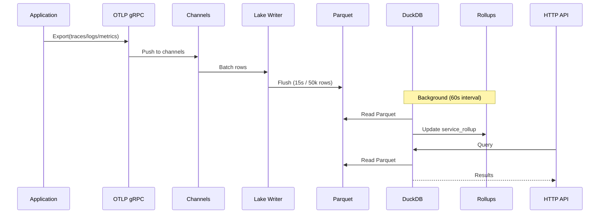
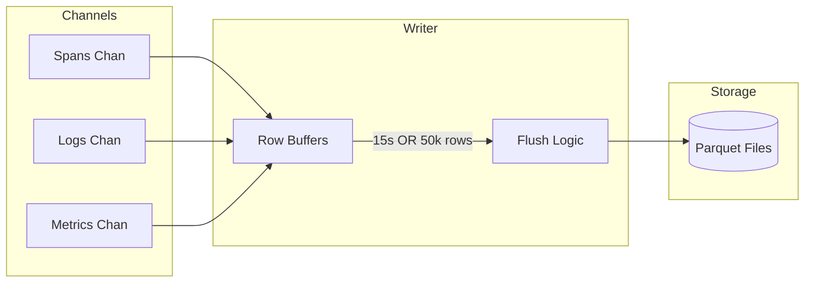
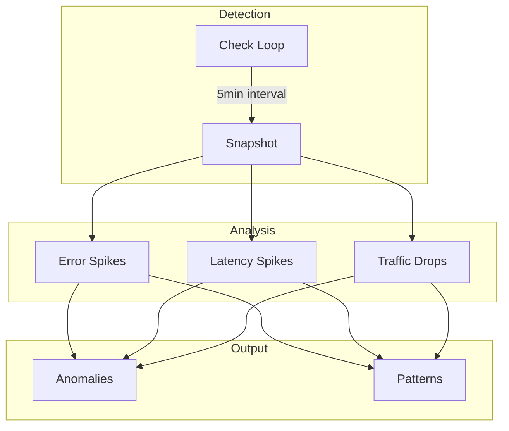
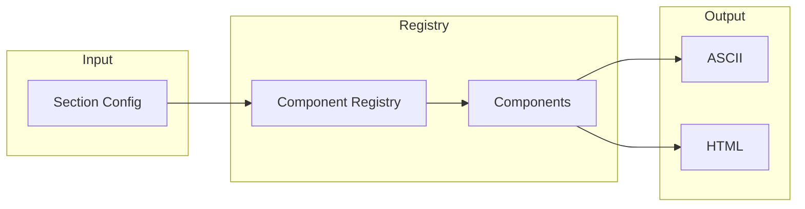
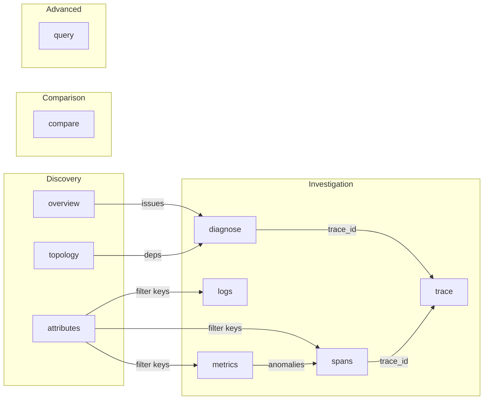
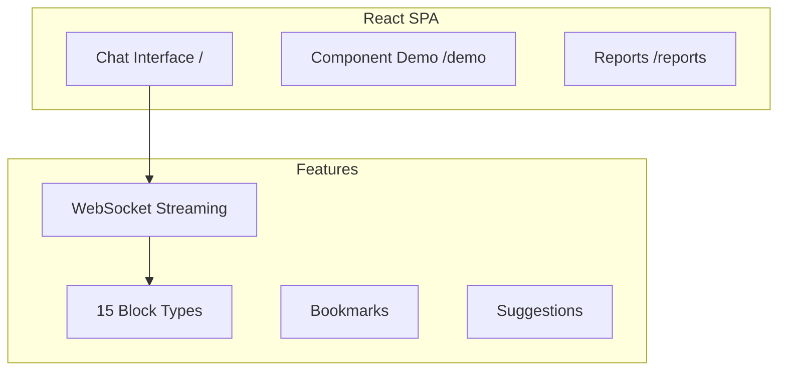
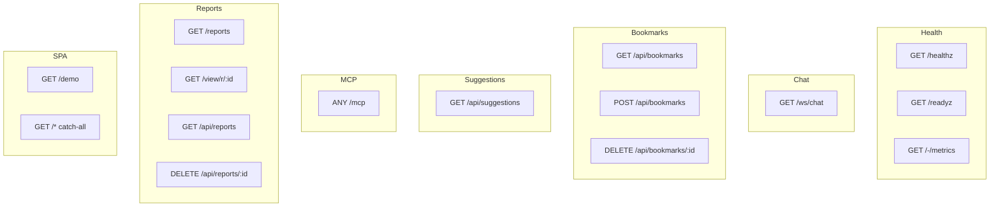
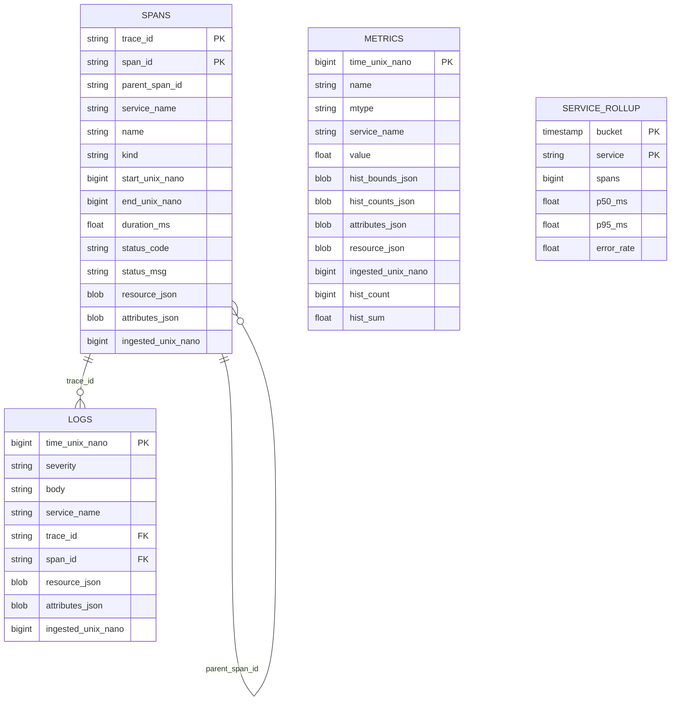
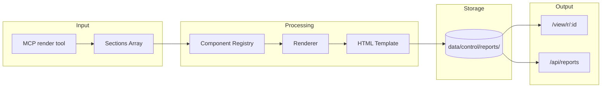

# Fanout Architecture

Single-binary observability platform: **ingest → lake → query → API + MCP**.

## System Overview

```mermaid
graph TB
    subgraph Ingest
        OTLP[OTLP gRPC :4317]
    end

    subgraph Channels
        CS[Spans Channel]
        CL[Logs Channel]
        CM[Metrics Channel]
    end

    subgraph Storage
        LW[Lake Writer]
        PQ[(Parquet Files)]
        PR[Retention Pruner]
    end

    subgraph Query
        DK[DuckDB Engine]
        RL[Service Rollups]
        SVC[Service Layer]
    end

    subgraph Intelligence
        AD[Anomaly Detector]
    end

    subgraph API
        HTTP[Echo HTTP :7520]
        UI[Web UI]
        MCP[MCP Server]
        RPT[Reports]
    end

    OTLP --> TI
    TI --> CS & CL & CM
    CS & CL & CM --> LW
    LW --> PQ
    PR -.-> PQ
    PQ --> DK
    DK --> RL
    DK --> AD
    RL --> SVC
    AD --> SVC
    SVC --> HTTP
    HTTP --> UI & MCP & RPT
```



## Data Flow



## Directory Structure

```
fanout/
├── cmd/fanout/              # Main entry point
├── internal/
│   ├── api/                 # HTTP handlers
│   │   ├── health.go        # /healthz, /readyz, /-/metrics
│   │   ├── ui.go            # Web UI routes
│   │   └── partials.go      # HTMX partial routes
│   ├── config/              # Environment configuration
│   ├── ingest/              # OTLP gRPC server
│   ├── intelligence/        # Anomaly detection
│   │   ├── detector.go      # Detection loop
│   │   └── types.go         # Snapshot, Anomaly types
│   ├── lake/                # Parquet storage
│   │   ├── writer.go        # Batch writer
│   │   └── retention.go     # Data pruning
│   ├── mcp/                 # MCP tools + server
│   │   ├── server.go        # MCP protocol handler
│   │   ├── overview.go      # overview tool
│   │   ├── topology.go      # topology tool
│   │   ├── spans.go         # spans tool
│   │   ├── logs.go          # logs tool
│   │   ├── metrics.go       # metrics tool
│   │   ├── trace.go         # trace tool
│   │   ├── diagnose.go      # diagnose tool
│   │   ├── compare.go       # compare tool
│   │   ├── attributes.go    # attributes tool
│   │   └── query.go         # query tool
│   ├── metrics/             # Prometheus metrics
│   ├── query/               # DuckDB engine
│   │   ├── duck.go          # Connection pool
│   │   ├── sql.go           # Query execution
│   │   ├── schema.go        # Table schemas
│   │   └── perf.go          # Performance tracking
│   ├── render/              # Report components
│   │   ├── registry.go      # Component registry
│   │   ├── render.go        # Report renderer
│   │   └── comp_*.go        # Individual components
│   ├── search/              # Query DSL parser
│   │   └── parser.go        # Search syntax
│   ├── service/             # Business logic
│   │   ├── service.go       # Service struct
│   │   ├── types.go         # Shared types
│   │   ├── status.go        # System health
│   │   ├── diagnose.go      # Service deep-dive
│   │   ├── find.go          # Search spans/logs
│   │   ├── trace.go         # Trace analysis
│   │   ├── timeline.go      # Time series
│   │   └── topology.go      # Service map
│   └── web/                 # React SPA (client/)
│       └── embed.go         # Embedded static assets
└── data/                    # Data directory (gitignored)
    ├── telemetry/
    │   ├── ducklake.sqlite
    │   └── parquet/
    │       └── main/{spans,logs,metrics}/...
    ├── query/
    │   ├── catalog.duckdb
    │   └── tmp/
    └── control/
        ├── fanout.sqlite
        ├── bookmarks/
        └── reports/
```

## Components

### Ingest (`internal/ingest/`)

gRPC OTLP services implementing:
- `collector.trace.v1.TraceService`
- `collector.logs.v1.LogsService`
- `collector.metrics.v1.MetricsService`

Each Export call:
1. Transforms OTLP data into normalized rows
2. Pushes to in-memory channels (non-blocking)

### Lake Writer (`internal/lake/`)



- **Flush triggers**: Timer (15s) OR row count (50k)
- **Partition path**: `data/telemetry/parquet/main/{spans|logs|metrics}/namespace=<ns>/year=YYYY/month=MM/day=DD/hour=HH/*.parquet`
- **Retention**: Background pruner removes data older than `RETENTION_DAYS`

### Query Engine (`internal/query/`)

- **DuckDB** reads directly from Parquet via glob patterns
- **Connection pool** for concurrent queries
- **Rollup table** (`service_rollup`) for fast dashboard queries:

```sql
CREATE TABLE IF NOT EXISTS service_rollup (
    bucket    TIMESTAMP,
    service   VARCHAR,
    spans     BIGINT,
    p50_ms    DOUBLE,
    p95_ms    DOUBLE,
    error_rate DOUBLE
);
```

Rollup refresh: Every 60s, aggregates last hour of span data.

### Intelligence (`internal/intelligence/`)

Background anomaly detection:



Detects:
- Error rate spikes (>3σ from baseline)
- Latency increases (P95 >2x normal)
- Traffic anomalies (sudden drops)

### Search DSL (`internal/search/`)

Query syntax for logs and traces:

```
word              # match containing "word"
"multi word"      # match exact phrase
-word             # exclude containing "word"
field:value       # filter by field
field:val1,val2   # multiple values (OR)
```

Supported fields:
- `service:name` - Filter by service
- `severity:ERROR,WARN` - Log severity
- `status:error` - Span status
- `operation:name` - Operation name

### Service Layer (`internal/service/`)

Shared business logic used by both MCP tools and Web UI:

| File | Function | Description |
|------|----------|-------------|
| `overview.go` | `Overview()` | System health overview |
| `diagnose.go` | `Diagnose(service)` | Service deep-dive |
| `spans.go` | `Spans(query)` | Search/aggregate spans |
| `logs.go` | `Logs(query)` | Search/aggregate logs |
| `metrics.go` | `Metrics(query)` | Query OTLP metrics |
| `trace.go` | `Trace(id)` | Distributed trace |
| `topology.go` | `Topology()` | Service dependency map |
| `attributes.go` | `Attributes()` | Discover attribute keys |

### Render System (`internal/render/`)

Composable component registry for reports:



**Registered Components:**

| Type | Description |
|------|-------------|
| `metric` | Single value with label and trend indicator |
| `metric-compare` | Value with comparison to previous period |
| `table` | Rows with headers, auto-truncation |
| `chart` | Vega-Lite specification |
| `text` | Styled text content |
| `badge` | Status indicator (healthy/warning/critical) |
| `bar` | Progress bar with value |
| `threshold-bar` | Bar with warning/critical thresholds |
| `sparkline` | Mini line chart |
| `histogram` | Distribution visualization |
| `heatmap` | 2D color grid |
| `grid` | Multi-column layout |
| `panel` | Grouped content with title |
| `stat-group` | Multiple stats in row |
| `slo` | SLO status with burn rate |
| `diff` | Before/after comparison |
| `timeline` | Event timeline |

## MCP Tools



### Tool Details

| Tool | Description |
|------|-------------|
| `overview` | System health, scores, top issues |
| `topology` | Service dependency map with blast radius |
| `spans` | Search/aggregate trace spans |
| `logs` | Search/aggregate log entries |
| `metrics` | Discover and query OTLP metric timeseries |
| `trace` | Distributed trace with root-cause analysis |
| `diagnose` | Deep-dive service analysis with baseline comparison |
| `compare` | Side-by-side: services, time windows, or operations |
| `attributes` | Discover filterable attribute keys |
| `query` | Raw SQL against DuckDB |

## Web UI

React SPA with a single AI-powered chat interface. The LLM calls MCP tools to gather data, then produces structured blocks (15 visual types) streamed over WebSocket.



## HTTP API



## Data Model



### Telemetry Query Surface

Telemetry is queried through DuckLake-backed views with clean column names:
```sql
SELECT service, duration_ms
FROM spans
WHERE start_time > now() - INTERVAL 15 MINUTE
```

## Report System



Report lifecycle:
1. MCP `render` tool receives sections config
2. Components render to HTML via registry
3. Report saved as JSON in `data/control/reports/`
4. Accessible via `/view/r/:id`
5. Auto-cleanup after 24h

## Configuration

Environment variables:

| Variable | Default | Description |
|----------|---------|-------------|
| `HTTP_ADDR` | `:7520` | HTTP server address |
| `OTLP_GRPC_ADDR` | `:4317` | OTLP gRPC address |
| `DATA_DIR` | `./data` | Storage root for telemetry, query cache, and control data |
| `FLUSH_SECONDS` | `15` | Batch flush interval |
| `FLUSH_BATCH_SIZE` | `50000` | Max rows per writer flush |
| `ROLLUP_EVERY` | `60` | Rollup refresh interval (seconds) |
| `JWT_SECRET` | - | HS256 signing key for access tokens |
| `JWT_REFRESH_SECRET` | - | HS256 signing key for refresh tokens |
| `MCP_ENABLED` | `true` | Enable MCP server at /mcp |
| `RETENTION_DAYS` | `30` | Data retention (0 = forever) |
| `DEFAULT_NAMESPACE` | `default` | Default namespace for services |

## Security

- **API auth**: User access tokens and per-user API keys
- **Rate limiting**: Configurable via `RATE_LIMIT_RPS`

## Performance Characteristics

| Operation | Target | Notes |
|-----------|--------|-------|
| Ingest throughput | 10k spans/s | Per instance |
| Dashboard query (rollup) | <100ms | Uses pre-aggregated data |
| Trace lookup | <500ms | Direct Parquet scan |
| Full table scan | <5s | Depends on data volume |
| Flush latency | 15s | Configurable freshness |

## Scaling Considerations

- **Horizontal read scaling**: Multiple instances can read same lake
- **Write scaling**: Single writer per lake directory
- **Query offload**: Consider ClickHouse for high-volume queries
- **Storage**: S3-compatible backends via DuckDB httpfs extension
