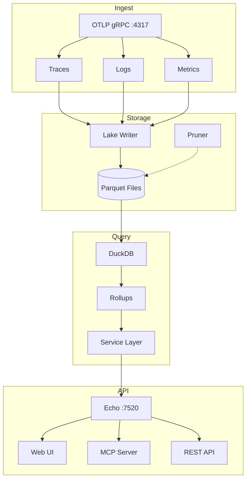
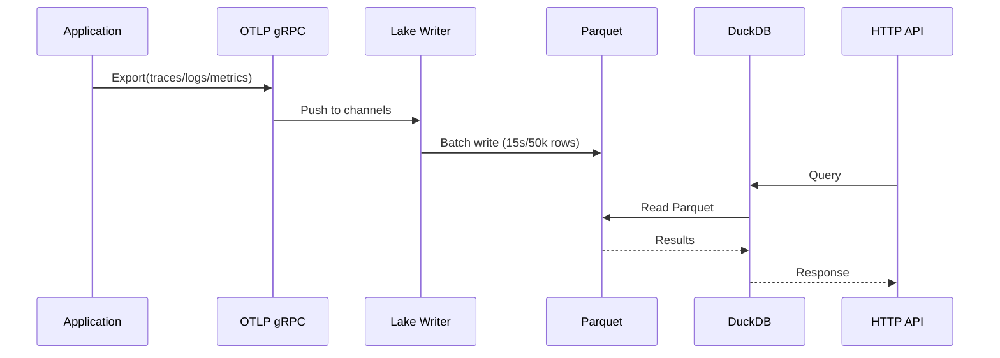
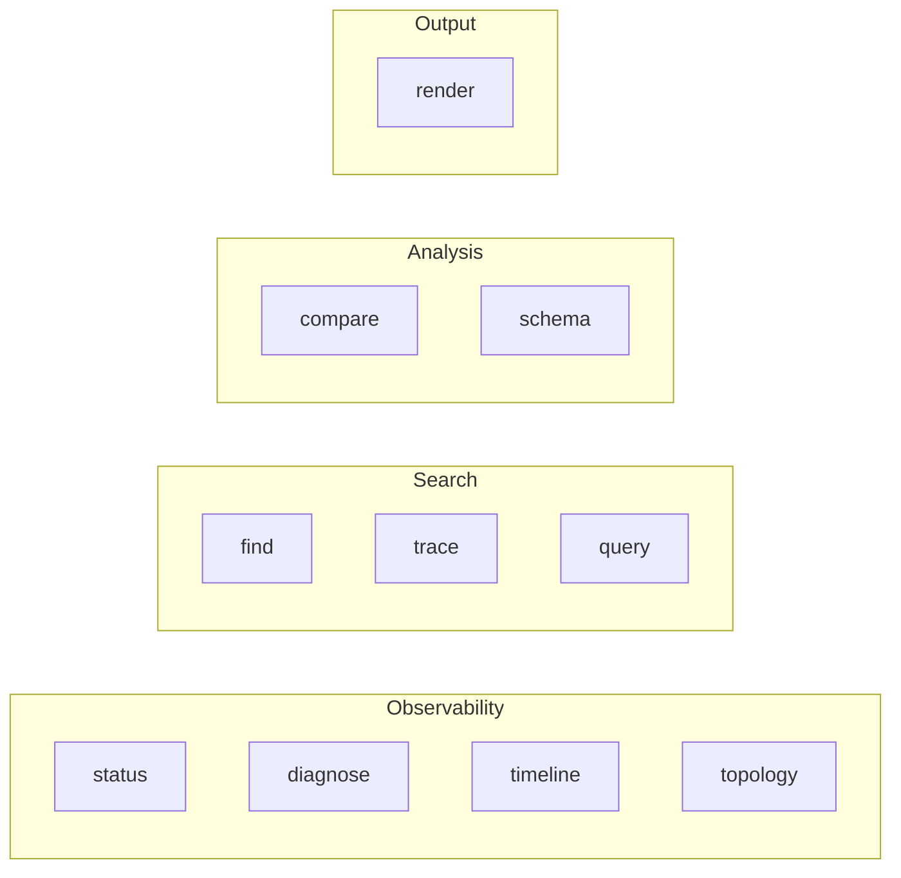
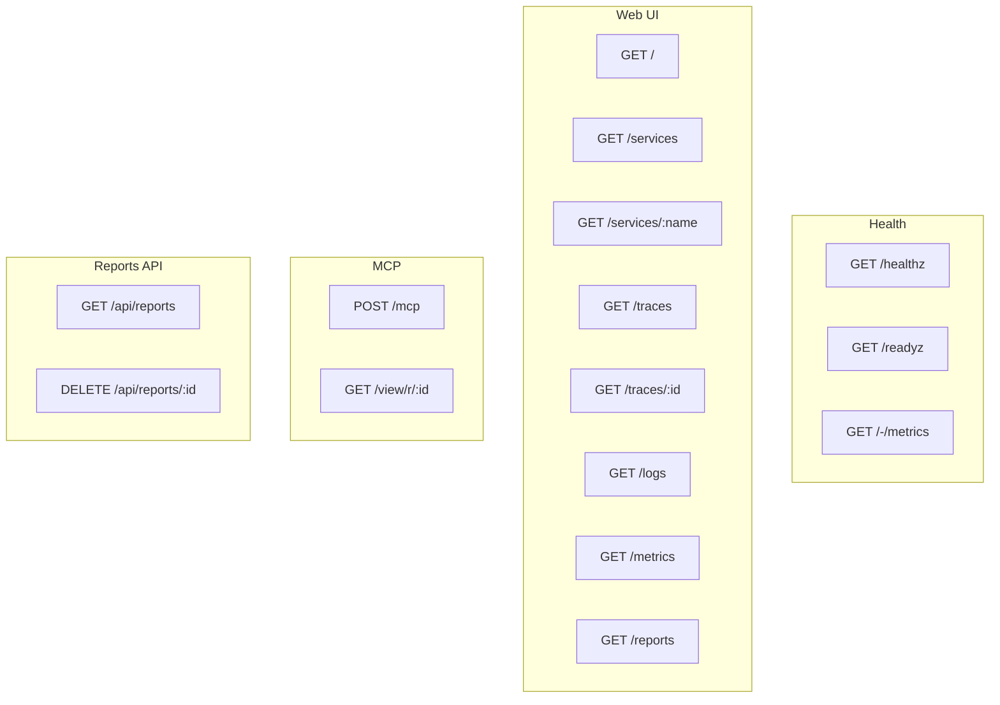
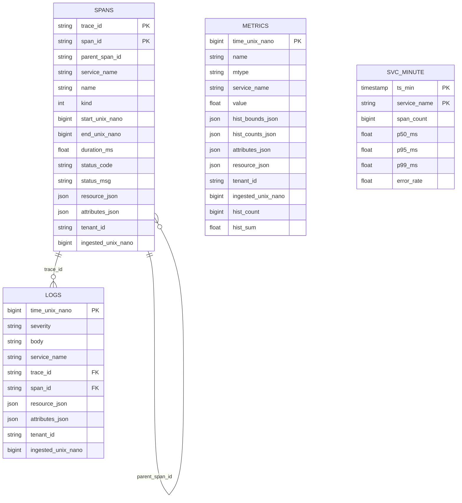
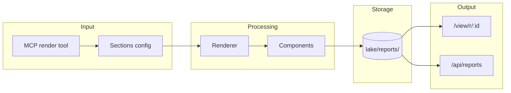

# Fanout Architecture

Single-binary observability platform: **ingest → lake → query → API + MCP**.

## System Overview



## Data Flow



## Components

### Ingest (`internal/ingest/`)

gRPC OTLP services implementing:
- `collector.trace.v1.TraceService`
- `collector.logs.v1.LogsService`
- `collector.metrics.v1.MetricsService`

Each Export call transforms OTLP data into normalized rows and pushes to in-memory channels.

### Lake Writer (`internal/lake/`)

- Micro-batches rows every 15s (configurable) into Parquet files
- Partition path: `/lake/{spans|logs|metrics}/year=YYYY/month=MM/day=DD/hour=HH/part-<unix>.parquet`
- **Pruner**: Automatic retention cleanup (default 30 days)

### Query Engine (`internal/query/`)

- **DuckDB** reads directly from Parquet files
- Maintains **`svc_minute`** rollups for fast dashboard queries
- In-process via CGO driver

### Service Layer (`internal/service/`)

Shared business logic for MCP tools and Web UI:
- `status.go` - System health overview
- `diagnose.go` - Service deep-dive (P50/P95/P99, errors, dependencies)
- `find.go` - Search spans/logs with filters
- `trace.go` - Distributed trace analysis with root-cause detection
- `timeline.go` - Time-bucketed metrics + anomaly detection
- `topology.go` - Service dependency mapping

### Render System (`internal/render/`)

Composable rendering for ASCII and HTML output:
- `Table`, `Badge`, `Metric`, `Chart` components
- `Compose` for combining multiple renderers
- Dual-format output (ASCII for terminal, HTML for reports)

## MCP Tools



| Tool | Description |
|------|-------------|
| `status` | System health overview with service counts |
| `diagnose` | Service deep-dive: P50/P95/P99, errors, slow ops, dependencies |
| `find` | Search spans/logs by pattern, service, status, severity |
| `trace` | Full trace with root-cause analysis |
| `timeline` | Time-bucketed metrics with anomaly detection |
| `topology` | Service dependency map with health status |
| `compare` | Side-by-side comparison of 2-4 services |
| `query` | Raw SQL against the data lake |
| `schema` | Database schema reference |
| `render` | Generate HTML reports from declarative sections |

## HTTP API



## Data Model



## Report System



Reports support these section types:
- `metric` - Single value with label
- `table` - Rows with headers
- `chart` - Vega-Lite specification
- `text` - Markdown content
- `badge` - Status indicator
- `grid` - Multi-column layout
- `panel` - Grouped content

## Configuration

All config via environment variables:

| Variable | Default | Description |
|----------|---------|-------------|
| `HTTP_ADDR` | `:7520` | HTTP server address |
| `OTLP_GRPC_ADDR` | `:4317` | OTLP gRPC address |
| `LAKE_DIR` | `./lake` | Parquet storage directory |
| `FLUSH_SECONDS` | `15` | Batch flush interval |
| `MAX_ROWS` | `50000` | Max rows per Parquet file |
| `ROLLUP_EVERY` | `60` | Rollup interval (seconds) |
| `API_TOKEN` | - | Bearer auth token (optional) |
| `MCP_ENABLED` | `true` | Enable MCP server |
| `RETENTION_DAYS` | `30` | Data retention (0 = forever) |

## Directory Structure

```
fanout/
├── cmd/fanout/          # Main entry point
├── internal/
│   ├── api/             # HTTP handlers + Web UI
│   ├── config/          # Configuration
│   ├── ingest/          # OTLP gRPC services
│   ├── lake/            # Parquet writer + pruner
│   ├── mcp/             # MCP tools + server
│   ├── query/           # DuckDB engine
│   ├── render/          # ASCII/HTML rendering
│   ├── service/         # Business logic
│   └── web/             # Templ templates
└── lake/                # Data directory (gitignored)
    ├── spans/
    ├── logs/
    ├── metrics/
    └── reports/
```

## Security & Tenancy

- Tenant isolation via `x-tenant-id` gRPC header
- Tenant ID stored in Parquet for query-time filtering
- Optional API bearer token auth (`API_TOKEN`)
- Rate limiting (`RATE_LIMIT_RPS`)

## Scaling

- **Horizontal**: Multiple instances can read the same lake directory
- **Higher concurrency**: Consider ClickHouse while keeping Parquet layout
- **Report cleanup**: Automatic expiration (24h default)
