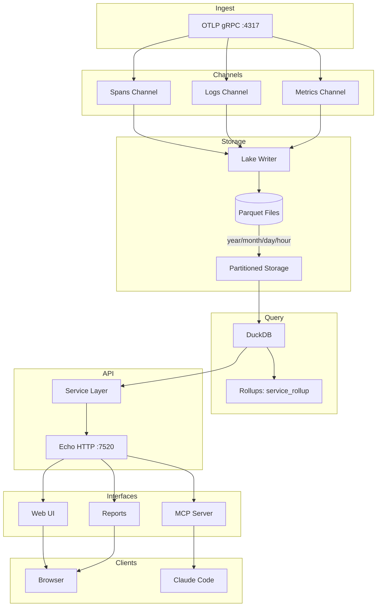
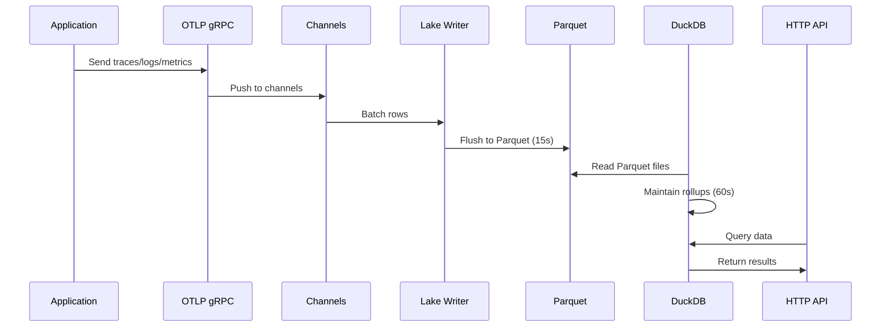
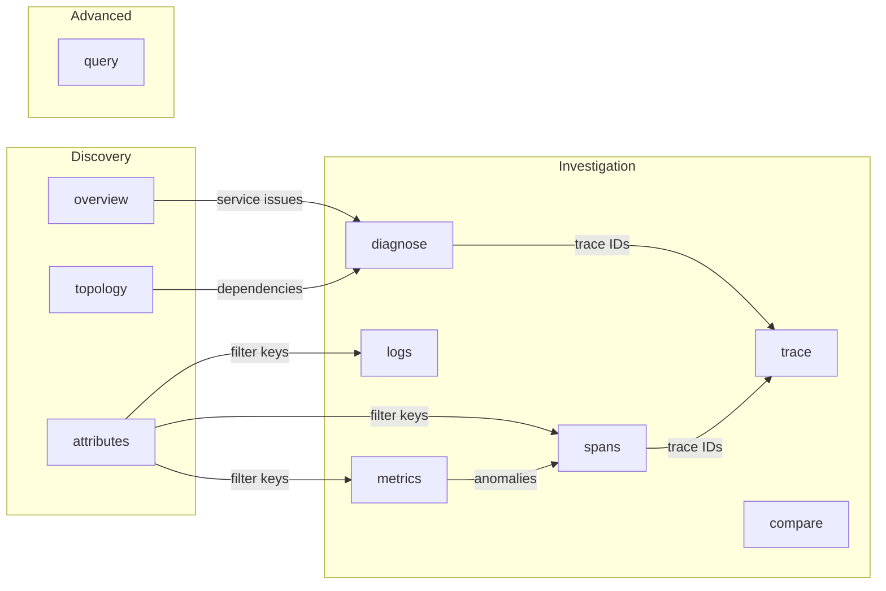
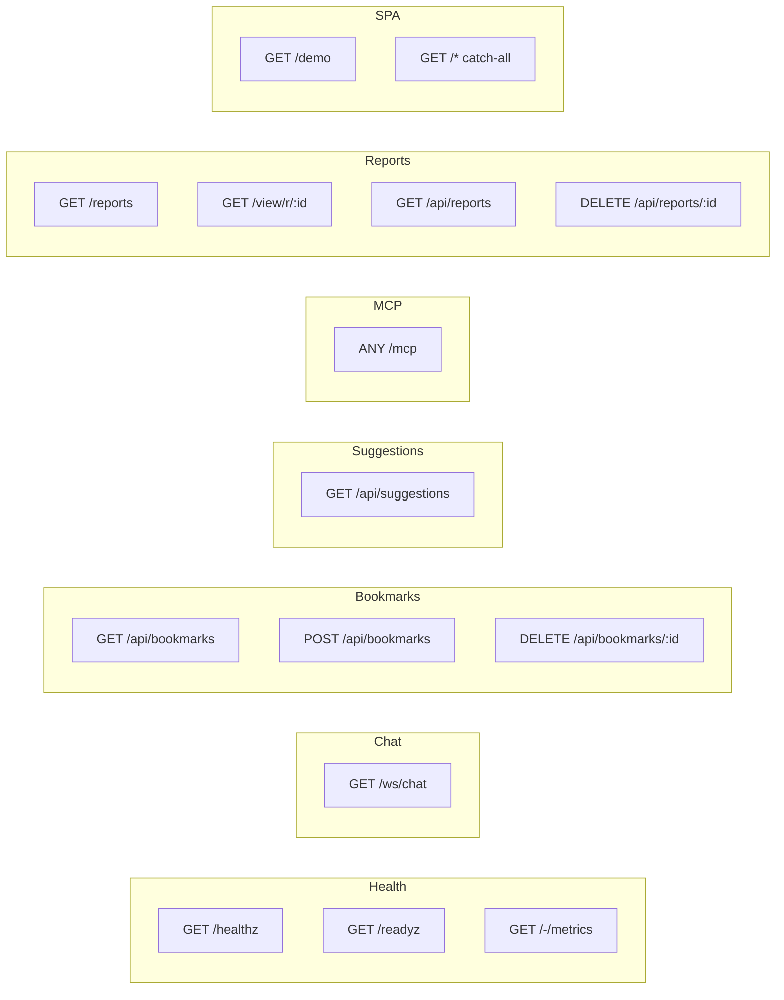
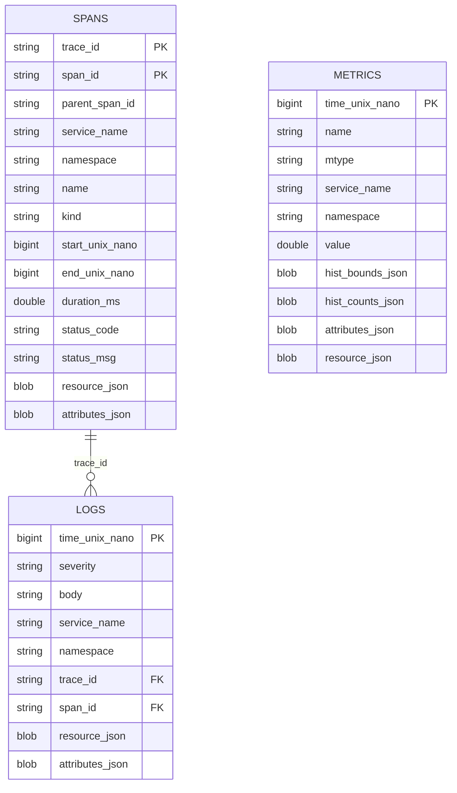

# CLAUDE.md

This file provides guidance to Claude Code (claude.ai/code) when working with code in this repository.

## Project Overview

Fanout is a single-binary observability platform that ingests OpenTelemetry (OTLP) traces, logs, and metrics via gRPC, stores them as partitioned Parquet files, and queries them using embedded DuckDB. Built with Go and Echo framework.

## Architecture



## Data Flow



## MCP Tools



| Tool | Description |
|------|-------------|
| `overview` | System health, scores, top issues |
| `topology` | Service dependency map with blast radius |
| `spans` | Search/aggregate trace spans |
| `logs` | Search/aggregate log entries |
| `metrics` | Discover and query OTLP metric timeseries |
| `trace` | Distributed trace with root-cause analysis |
| `diagnose` | Deep-dive service analysis with baseline comparison |
| `compare` | Side-by-side: services, time windows, or operations |
| `attributes` | Discover filterable attribute keys |
| `query` | Raw SQL against DuckDB |

## Directory Structure

```
cmd/
  fanout/         # Main binary

internal/
  api/            # HTTP handlers (health, UI routes)
  config/         # Environment config
  ingest/         # OTLP gRPC server
  intelligence/   # Anomaly detection
  lake/           # Parquet writer + retention
  mcp/            # MCP server + tools
  metrics/        # Prometheus metrics
  query/          # DuckDB queries + rollups
  render/         # ASCII/HTML rendering
  service/        # Business logic layer
  web/            # Templ templates

data/             # Data storage (gitignored)
  telemetry/      # DuckLake metadata + parquet files
  query/          # DuckDB catalog + temp files
  control/        # Fanout SQLite, bookmarks, reports
```

## Build & Run

```bash
# Build (requires CGO for DuckDB)
export CGO_ENABLED=1
go build -o bin/fanout ./cmd/fanout

# Run
./bin/fanout

# Or with just
just build
just run
```

## First-time setup (per service .env files)

The deploy + local compose flows read per-service env files that are
gitignored. Before the first `docker compose` invocation or `./scripts/yeet.sh`
deploy, bootstrap them from their committed templates:

```bash
cp traefik/.env.example traefik/.env && $EDITOR traefik/.env  # CF_DNS_API_TOKEN
cp fanout/.env.example  fanout/.env  && $EDITOR fanout/.env   # JWT/SMTP/AI
cp demo/.env.example    demo/.env    && $EDITOR demo/.env     # JWT/SMTP/AI + otel-demo pins
```

Without these files, `docker compose config` / `up` / `build` errors out
at parse time on `include.env_file: demo/.env`.

## Configuration

| Variable | Default | Description |
|----------|---------|-------------|
| `HTTP_ADDR` | `:7520` | HTTP server address |
| `OTLP_GRPC_ADDR` | `:4317` | OTLP gRPC address |
| `DATA_DIR` | `./data` | Storage root for telemetry, query cache, and control data |
| `FLUSH_SECONDS` | `15` | Batch flush interval |
| `FLUSH_BATCH_SIZE` | `50000` | Max rows per writer flush |
| `ROLLUP_EVERY` | `60` | Rollup interval (seconds) |
| `DUCKDB_MEMORY` | self-sized (80% of RAM, cgroup-aware) | DuckDB memory cap (e.g. `8GB`) |
| `DUCKDB_THREADS` | self-sized (one per core) | DuckDB query worker threads |
| `DUCKDB_MAX_CONNS` | `4` | DuckDB connection pool size |
| `JWT_SECRET` | - | HS256 access-token signing key |
| `JWT_REFRESH_SECRET` | - | HS256 refresh-token signing key |
| `MCP_ENABLED` | `true` | Enable MCP server |
| `RETENTION_DAYS` | `30` | Data retention (0 = forever) |

## API Endpoints



## Data Schema

### Parquet Files



### Namespace Support

The `namespace` field captures OTLP's `service.namespace` resource attribute, allowing multi-product deployments to logically separate services. Switch namespace via the header picker in the UI; MCP tools accept an explicit `namespace` argument.

```bash
# Configure via OTEL resource attributes
OTEL_RESOURCE_ATTRIBUTES=service.namespace=product-a
```

### Rollup Table (service_rollup)

| Column | Type | Description |
|--------|------|-------------|
| `bucket` | TIMESTAMP | 1-minute bucket |
| `service` | VARCHAR | Service name |
| `spans` | BIGINT | Request count |
| `error_rate` | DOUBLE | Error rate (0-1) |
| `p50_ms` | DOUBLE | P50 latency |
| `p95_ms` | DOUBLE | P95 latency |

## Report System

```mermaid
graph TB
    subgraph Generation
        LLM[Claude Code]
        QUERY[query tool]
        RENDER[render tool]
        LLM --> QUERY
        QUERY --> LLM
        LLM --> RENDER
    end

    subgraph Storage
        RENDER --> JSON[(data/control/reports/*.json)]
        JSON --> |expires 24h| CLEANUP[Cleanup Goroutine]
    end

    subgraph Viewing
        JSON --> VIEW[/view/r/:id]
        JSON --> LIST[/reports]
        VIEW --> HTML[Shoelace + Vega-Lite]
    end
```

**Components:** metric, table, chart, text, grid, panel, badge, bar, sparkline

## Dependencies

| Library | Purpose |
|---------|---------|
| `echo/v4` | HTTP framework |
| `duckdb-go/v2` | DuckDB driver (CGO) |
| `parquet-go` | Parquet writer |
| `templ` | Template engine |
| `go-sdk/mcp` | MCP SDK |
| `grpc` | gRPC server |
| `otlp` | OTLP protocol |

## Testing

```bash
# Start fanout
./bin/fanout

# Use otel-demo for test data (in separate terminal)
cd ../otel-demo && docker compose up -d

# Or configure any OTLP-compatible app
OTEL_EXPORTER_OTLP_ENDPOINT=demo.fanout.test:4317
OTEL_EXPORTER_OTLP_PROTOCOL=grpc
OTEL_SERVICE_NAME=my-service
```

## Performance

- Flush interval: 15s (freshness vs I/O tradeoff)
- Rollups: 60s aggregation cycle
- Query targets: P95 < 1.5s (rollups), < 5s (raw scans)
- Report cleanup: hourly, 24h expiration
