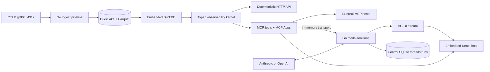

# CLAUDE.md

This file is the working architecture guide for Claude Code and other coding
agents in this repository.

## Documentation source of truth

Read [`docs/README.md`](docs/README.md) before changing product behavior.
Canonical shipped behavior lives in `openspec/specs/`; proposed behavior lives
in a named `openspec/changes/` directory; archived changes preserve rationale.
Use the generated `/opsx:*` commands and keep code, tests, specs, and public docs
aligned. Dated files under an OpenSpec archive are historical evidence, not
current requirements.

## Product boundary

Fanout is one Go executable for OpenTelemetry investigation. It owns:

- OTLP gRPC ingest and durable telemetry storage.
- DuckDB/DuckLake queries and typed observability semantics.
- a standard MCP server and portable MCP App resources.
- the model/tool execution loop exposed as an AG-UI event stream.
- owner-scoped thread/run history in the existing control SQLite database.
- the compiled React host, embedded into the executable.

Fanout does not own a proprietary UI-block protocol. Rich tool results use MCP
Apps, while AG-UI is the wire contract between the Go agent runtime and the
browser. Bun is required only while compiling browser assets; Node and Bun are
not present in the release image or required at runtime.

## Architecture



The internal agent calls the same MCP tools as external clients. Its connection
is in-memory, so there is no HTTP self-call, internal bearer token, sidecar, or
second service.

## Interface contracts

### AG-UI

`internal/agent` emits standard run, text-message, tool-call, tool-result, and
activity events at `POST /api/agent`. MCP App results are carried as
`ACTIVITY_SNAPSHOT` events with `activityType: "mcp-app"`; the activity payload
contains the MCP resource URI and the tool input/result needed by the app.

The browser uses `@ag-ui/client` directly. Do not add a JavaScript agent server
or CopilotKit runtime unless the product intentionally gives up the one-process
constraint.

### MCP and MCP Apps

The current standard tools are:

| Tool | Result |
| --- | --- |
| `observability_overview` | Health, service metrics, and status overview plus `ui://fanout/observability-overview.html` |
| `service_topology` | Dependency graph, traffic flow, and error matrix plus `ui://fanout/service-topology.html` |
| `service_performance` | Activity, latency heatmap, endpoints, and comparison plus `ui://fanout/service-performance.html` |
| `trace_detail` | Trace waterfall, flame graph, and correlated logs plus `ui://fanout/trace-detail.html` |
| `search_logs` | Searchable logs and severity histogram plus `ui://fanout/log-explorer.html` |

Each tool returns authoritative structured output with scope and provenance.
Hosts without MCP Apps still receive useful structured/text results. The web
host renders app resources using the official `AppBridge` and
`PostMessageTransport`; do not reintroduce Fanout-specific block mapping.

Four dashboard tools (`internal/mcp/dashboards.go`) manage named, owner-scoped
dashboards stored in the control SQLite database:

| Tool | Result |
| --- | --- |
| `dashboard_list` | The owner's dashboards with widget counts |
| `dashboard_get` | One dashboard's widgets, shared filters, and 12-column layout |
| `dashboard_create` | Adds a complete named dashboard (additive) |
| `dashboard_update` | Replaces an existing dashboard's design (destructive; explicit request only) |

Dashboard tools require the `fanout:dashboard` OAuth scope in addition to
`fanout:read`; the owner comes from the verified token (or the internal
agent's request meta), never from tool input.

### UI package naming

`internal/ui` is intentionally small: it embeds and serves the compiled
browser shell. React source lives in `ui/host`; portable tool-result apps live
in `ui/apps`. The Go `ui` package is not a renderer registry.

## Repository layout

```text
cmd/fanout/                 process composition and the single entry point
internal/agent/             providers, AG-UI runtime, MCP tool adapter, history
internal/alert/             expr-lang alert engine, rule store, webhook delivery
internal/api/               HTTP routes, auth middleware, settings, alerts, health
internal/auth/              email/OIDC login, browser sessions, MCP OAuth store
internal/dashboard/         dashboard domain service, validation, and identity
internal/db/                control SQLite schema, migrations, and sqlc queries
internal/env/               environment config loading and validation
internal/id/                UUIDv7 identifier generation
internal/ingest/            OTLP gRPC receiver
internal/intelligence/      anomaly detection
internal/lake/              DuckLake/Parquet writer and maintenance
internal/mcp/               MCP tools, server, and embedded MCP App HTML
internal/metrics/           Prometheus metrics
internal/observability/     typed query/result domain types
internal/query/             DuckDB catalog, queries, and rollups
internal/settings/          ingest-token and application settings store
internal/store/             control SQLite bootstrap
internal/ui/                embedded compiled browser assets only
ui/host/                    React AG-UI browser host (build-time)
ui/apps/                    portable React MCP Apps (build-time)
site/                       public site and documentation
```

## Build and run

```bash
just install
just build
just up   # local dev stack; `just down` to stop
```

`just build` compiles both TypeScript projects and then builds `bin/fanout`.
The Dockerfile uses Bun stages for those assets and copies only the Go binary
into the final `fanout` image.

Local application URLs use the shared development hostname:

- application: `https://demo.fanout.test`
- MCP: `https://demo.fanout.test/mcp`
- OTLP endpoint advertised to local collectors: `demo.fanout.test:4317`
- marketing/docs: `https://fanout.test`

Use `127.0.0.1` only when describing an actual bind address, reverse-proxy
upstream, or container health check—not as a user-facing application URL.

## Required configuration

Fanout loads `.env`, then `.env.${ENV}` (default `development`). Core settings:

| Variable | Default | Purpose |
| --- | --- | --- |
| `HTTP_ADDR` | `:7520` | HTTP, AG-UI, MCP, and embedded web listener |
| `OTLP_GRPC_ADDR` | `127.0.0.1:4317` | OTLP gRPC bind address |
| `INGEST_ENDPOINT` | derived | public collector endpoint shown during setup |
| `DATA_DIR` | `./data` | telemetry, query state, and control SQLite |
| `DEFAULT_NAMESPACE` | `default` | fallback OTLP service namespace |
| `MCP_ENABLED` | `true` | expose OAuth-protected `/mcp` and session-protected `/api/mcp` |
| `MCP_PUBLIC_URL` | `https://demo.fanout.test/mcp` | canonical public MCP URL — the OAuth issuer/resource (audience) for `/mcp`; MUST be set to the deployment's public URL for external MCP clients; HTTPS ending in `/mcp` |
| `AI_PROVIDER` | `anthropic` | `anthropic` or `openai` |
| `AI_API_KEY` | required | model provider credential |
| `AI_MODEL` | provider default | optional model override |
| `AI_BASE_URL` | provider default | optional compatible gateway |
| `AUTH_MODE` | `local` | browser login mode: `local` or `oidc` |
| `AUTH_CODE_SECRET` | local mode | email-code HMAC key, at least 32 characters |
| `PUBLIC_URL` | none | canonical external HTTPS origin; required for OIDC and Secure cookies behind a TLS-terminating proxy |
| `SESSION_IDLE_TTL` | `12h` | browser-session idle lifetime |
| `SESSION_ABSOLUTE_TTL` | `168h` | browser-session absolute lifetime |
| `PUBLIC_READ` | `false` | anonymous access to explicitly classified telemetry reads only |
| `PUBLIC_INGEST` | `false` | disable OTLP authentication; demo-only |
| `METRICS_PUBLIC` | `false` | expose `/-/metrics` without authentication |
| `METRICS_TOKEN` | optional | non-interactive bearer credential for private `/-/metrics`; admin sessions are also accepted |
| `TRUSTED_PROXY_CIDRS` | empty | comma-separated proxy CIDRs allowed to supply forwarded client IPs |
| `OIDC_ISSUER_URL` | OIDC mode | HTTPS issuer used for discovery |
| `OIDC_CLIENT_ID` / `OIDC_CLIENT_SECRET` | OIDC mode | relying-party credentials |
| `OIDC_EMAIL_CLAIM` | `email` | trusted claim containing the login email |
| `OIDC_EMAIL_VERIFICATION` | `required` | `required` or issuer-policy mode |
| `OIDC_AUTO_PROVISION` | `false` | allow JIT users that match an allow policy |
| `OIDC_ALLOWED_GROUPS` / `OIDC_ALLOWED_DOMAINS` | none | JIT and issuer-mode allow policy |
| `OIDC_DEFAULT_ROLE` | `viewer` | role assigned to an allowed JIT user |
| `OIDC_OPERATOR_GROUPS` / `OIDC_ADMIN_GROUPS` | none | groups that elevate JIT users above viewer |
| `SMTP_HOST/USER/PASS/FROM` | local mode | email-code login delivery |

The provider defaults are defined in `internal/agent/provider_http.go`. Keep model
and SDK changes current and verify them against upstream sources before bumping.

## HTTP surface

| Method/path | Purpose |
| --- | --- |
| `GET /healthz`, `GET /readyz` | liveness/readiness |
| `GET /-/metrics` | Prometheus metrics |
| `POST /api/agent` | AG-UI event stream |
| `GET /api/agent/threads/:threadID` | owner-scoped thread history |
| `GET /api/observability/...` | deterministic typed query API |
| `/api/dashboards*`, `/api/dashboard` | owner-scoped dashboard CRUD and default dashboard state |
| `ANY /mcp` | streamable HTTP MCP server |
| `/api/auth/*` | setup, email/OIDC login, logout, and MCP OAuth consent |
| `GET /`, `GET /*` | embedded browser shell and SPA fallback |

Auth middleware is global. Browser authentication uses opaque server-side
sessions in an HttpOnly cookie. Thread IDs are not authorization boundaries; the SQLite store
always scopes them to the authenticated owner ID.

## Persistence

- telemetry data: DuckLake catalog plus partitioned Parquet under
  `DATA_DIR/telemetry`.
- query catalog/temp data: `DATA_DIR/query`.
- users, settings, alerts, MCP OAuth clients/codes/tokens, dashboards,
  AG-UI threads, and runs: `DATA_DIR/control/fanout.sqlite`.

Agent history tables are `agui_threads` and `agui_runs`. No PostgreSQL or
separate conversation database is used.

## Verification

```bash
just check
just docs-check
go test ./...
go vet ./...
docker build --target fanout -t fanout:dev .
```

The existing alert webhook tests open a loopback listener, so restricted
sandboxes may need local-listener permission. Browser assets must be rebuilt
before Go tests because `internal/ui` embeds the generated `dist` directory.

For manual testing through the shared proxy, open
`https://demo.fanout.test`. The standalone binary and public quick start may
use `http://localhost:7520`; reserve `127.0.0.1` for bind addresses,
reverse-proxy upstreams, and health checks.
