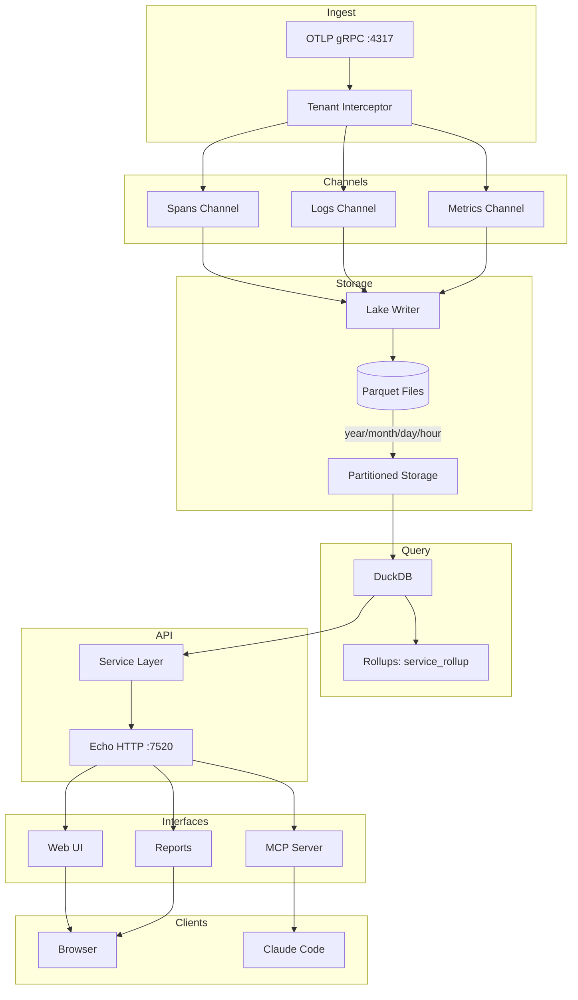
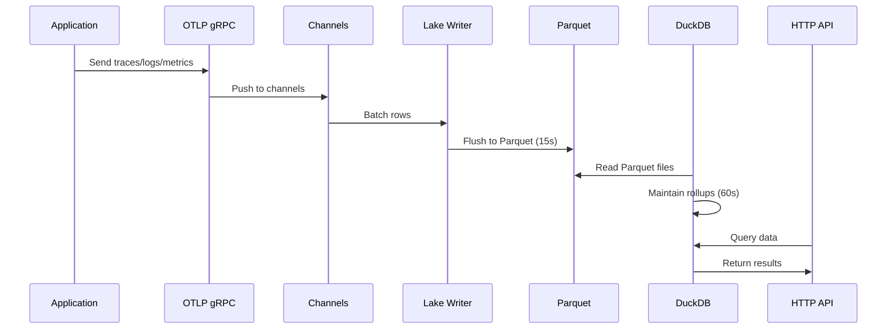
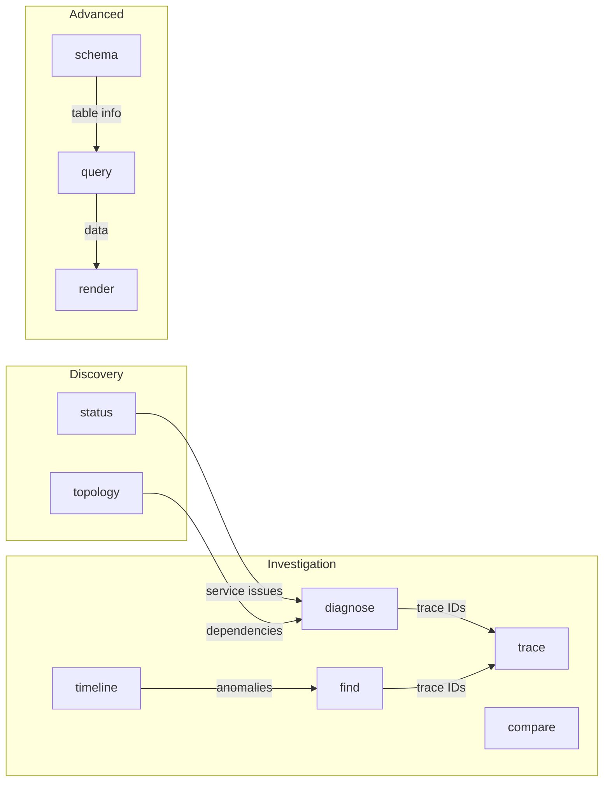
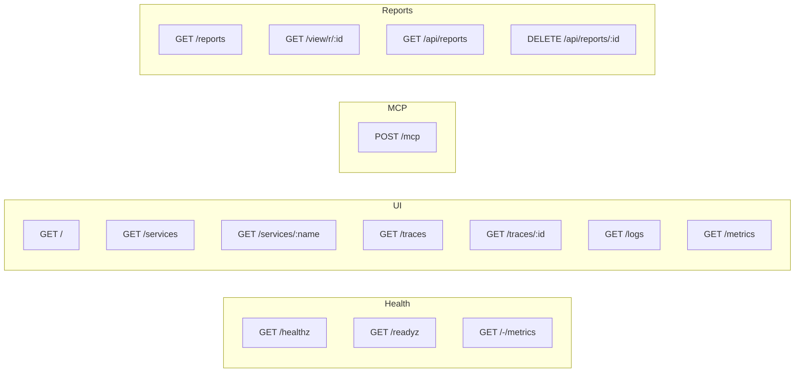
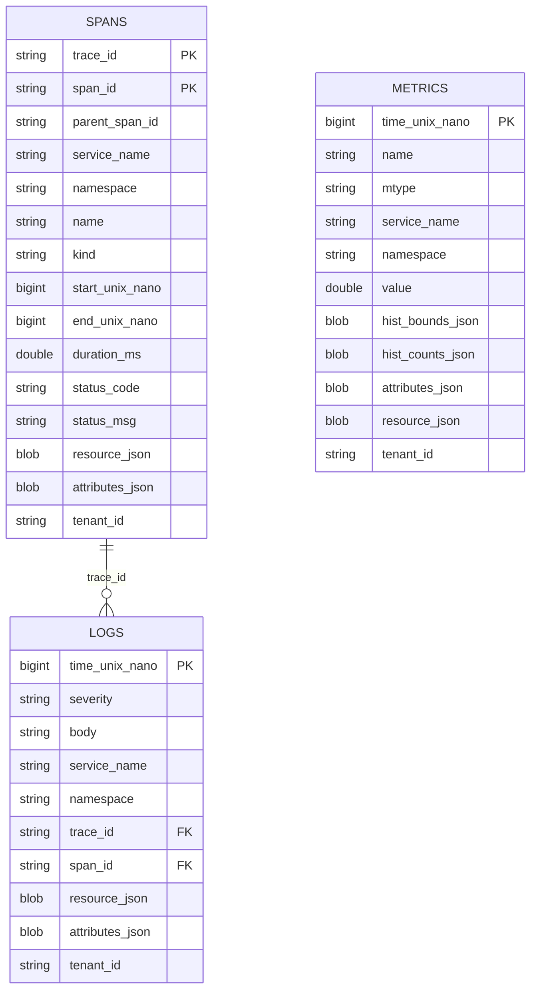

# CLAUDE.md

This file provides guidance to Claude Code (claude.ai/code) when working with code in this repository.

## Project Overview

Fanout is a single-binary observability platform that ingests OpenTelemetry (OTLP) traces, logs, and metrics via gRPC, stores them as partitioned Parquet files, and queries them using embedded DuckDB. Built with Go and Echo framework.

## Architecture



## Data Flow



## MCP Tools



| Tool | Description |
|------|-------------|
| `status` | System health overview, top issues, key metrics |
| `diagnose` | Deep-dive: P50/P95/P99 latency, errors, dependencies |
| `find` | Search spans/logs by pattern, service, status, severity |
| `trace` | Distributed trace with root-cause analysis |
| `timeline` | Time-bucketed metrics with anomaly detection |
| `topology` | Service dependency map with health status |
| `query` | Raw SQL against DuckDB |
| `schema` | Database schema reference for SQL queries |
| `render` | Generate HTML reports with charts (Vega-Lite) |
| `compare` | Side-by-side service comparison |

## Directory Structure

```
cmd/
  fanout/         # Main binary

internal/
  api/            # HTTP handlers (health, UI routes)
  config/         # Environment config
  ingest/         # OTLP gRPC server
  intelligence/   # Anomaly detection
  lake/           # Parquet writer + retention
  mcp/            # MCP server + tools
  metrics/        # Prometheus metrics
  query/          # DuckDB queries + rollups
  render/         # ASCII/HTML rendering
  service/        # Business logic layer
  web/            # Templ templates

lake/             # Data storage (gitignored)
  spans/          # Trace spans
  logs/           # Log entries
  metrics/        # Metric points
  reports/        # Saved HTML reports
```

## Build & Run

```bash
# Build (requires CGO for DuckDB)
export CGO_ENABLED=1
go build ./cmd/fanout

# Run
./fanout

# Or with just
just build
just run
```

## Configuration

| Variable | Default | Description |
|----------|---------|-------------|
| `HTTP_ADDR` | `:7520` | HTTP server address |
| `OTLP_GRPC_ADDR` | `:4317` | OTLP gRPC address |
| `LAKE_DIR` | `./lake` | Parquet storage directory |
| `FLUSH_SECONDS` | `15` | Batch flush interval |
| `MAX_ROWS` | `50000` | Max rows per Parquet file |
| `ROLLUP_EVERY` | `60` | Rollup interval (seconds) |
| `API_TOKEN` | - | Bearer auth token (optional) |
| `MCP_ENABLED` | `true` | Enable MCP server |
| `RETENTION_DAYS` | `30` | Data retention (0 = forever) |

## Tenancy Model

Fanout is designed for **single-tenant deployment**. While `tenant_id` is captured during ingest (from `x-tenant-id` gRPC metadata or `DEFAULT_TENANT_ID` env var), it is **not enforced** in queries—all users see all data.

For multi-tenant deployments:
- Deploy separate Fanout instances per tenant, OR
- Add tenant filtering to query paths in `internal/service/` and `internal/mcp/`

## API Endpoints



## Data Schema

### Parquet Files



### Namespace Support

The `namespace` field captures OTLP's `service.namespace` resource attribute, allowing multi-product deployments to logically separate services. Use `ns:` filter in UI search or MCP tools.

```bash
# Configure via OTEL resource attributes
OTEL_RESOURCE_ATTRIBUTES=service.namespace=product-a
```

### Rollup Table (service_rollup)

| Column | Type | Description |
|--------|------|-------------|
| `bucket` | TIMESTAMP | 1-minute bucket |
| `service` | VARCHAR | Service name |
| `spans` | BIGINT | Request count |
| `error_rate` | DOUBLE | Error rate (0-1) |
| `p50_ms` | DOUBLE | P50 latency |
| `p95_ms` | DOUBLE | P95 latency |

## Report System

```mermaid
graph TB
    subgraph Generation
        LLM[Claude Code]
        QUERY[query tool]
        RENDER[render tool]
        LLM --> QUERY
        QUERY --> LLM
        LLM --> RENDER
    end

    subgraph Storage
        RENDER --> JSON[(lake/reports/*.json)]
        JSON --> |expires 24h| CLEANUP[Cleanup Goroutine]
    end

    subgraph Viewing
        JSON --> VIEW[/view/r/:id]
        JSON --> LIST[/reports]
        VIEW --> HTML[Shoelace + Vega-Lite]
    end
```

**Components:** metric, table, chart, text, grid, panel, badge, bar, sparkline

## Dependencies

| Library | Purpose |
|---------|---------|
| `echo/v4` | HTTP framework |
| `duckdb-go/v2` | DuckDB driver (CGO) |
| `parquet-go` | Parquet writer |
| `templ` | Template engine |
| `go-sdk/mcp` | MCP SDK |
| `grpc` | gRPC server |
| `otlp` | OTLP protocol |

## Testing

```bash
# Start fanout
./fanout

# Use otel-demo for test data (in separate terminal)
cd ../otel-demo && docker compose up -d

# Or configure any OTLP-compatible app
OTEL_EXPORTER_OTLP_ENDPOINT=localhost:4317
OTEL_EXPORTER_OTLP_PROTOCOL=grpc
OTEL_SERVICE_NAME=my-service
```

## Performance

- Flush interval: 15s (freshness vs I/O tradeoff)
- Rollups: 60s aggregation cycle
- Query targets: P95 < 1.5s (rollups), < 5s (raw scans)
- Report cleanup: hourly, 24h expiration
