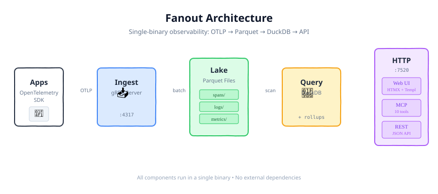

# Fanout

Single-binary observability platform. Ingest OTLP, store in DuckLake, query with DuckDB.

<p align="center">
  
</p>

**Documentation:**
- [Architecture](ARCHITECTURE.md) - System design, data flow, components
- [Requirements](REQUIREMENTS.md) - Product scope, configuration, build

## Quick Start

```bash
# Configure required secrets and auth settings
cp .env.example .env

# Build
export CGO_ENABLED=1
go build ./cmd/fanout

# Run
./fanout

# Or build and run the Docker image directly
docker build -t fanout .
docker run --rm --env-file .env -p 7520:7520 -p 4317:4317 fanout
```

Then open `http://localhost:7520/login` and use the `SETUP_TOKEN` from `.env` to create the first admin account.

For the production compose stack, fill the OTLP mTLS envs in `.env` before running `docker compose up -d`.

**Ports:**
- `7520` - HTTP API + MCP (`/mcp`)
- `4317` - OTLP gRPC ingest

## MCP Tools

Connect Claude Code or any MCP client to `https://fanout.test/mcp`

| Tool | Description |
|------|-------------|
| `overview` | System health, scores, top issues |
| `topology` | Service dependency map with blast radius |
| `spans` | Search/aggregate trace spans |
| `logs` | Search/aggregate log entries |
| `metrics` | Discover and query OTLP metric timeseries |
| `trace` | Distributed trace with root-cause analysis |
| `diagnose` | Deep-dive service analysis with baseline comparison |
| `compare` | Side-by-side: services, time windows, or operations |
| `attributes` | Discover filterable attribute keys |
| `query` | Raw SQL against DuckDB |

MCP clients receive full JSON Schema via `tools/list`.

## Configuration

| Variable | Default | Description |
|----------|---------|-------------|
| `HTTP_ADDR` | `:7520` | HTTP server address |
| `OTLP_GRPC_ADDR` | `:4317` | OTLP gRPC address |
| `DATA_DIR` | `./data` | Storage root for telemetry, query cache, and control data |
| `FLUSH_SECONDS` | `15` | Batch flush interval |
| `FLUSH_BATCH_SIZE` | `50000` | Max rows per writer flush |
| `ROLLUP_EVERY` | `60` | Rollup refresh (seconds) |
| `AI_PROVIDER` | `anthropic` | AI provider (`anthropic` or `openai`) |
| `AI_API_KEY` | - | Required LLM API key |
| `AI_MODEL` | provider default | Optional model override |
| `AI_BASE_URL` | provider default | Optional API base URL override |
| `SMTP_HOST` | - | SMTP server host for web auth |
| `SMTP_PORT` | `587` | SMTP server port |
| `SMTP_USER` | - | SMTP username for web auth |
| `SMTP_PASS` | - | SMTP password for web auth |
| `SMTP_FROM` | - | Sender address for login/setup emails |
| `SETUP_TOKEN` | - | Required first-boot setup token for creating the first admin |
| `JWT_SECRET` | - | HS256 signing key for access tokens |
| `JWT_REFRESH_SECRET` | - | HS256 signing key for refresh tokens |
| `OTLP_TLS_CERT_FILE` | - | OTLP gRPC server certificate file |
| `OTLP_TLS_KEY_FILE` | - | OTLP gRPC server private key file |
| `OTLP_TLS_CLIENT_CA_FILE` | - | CA bundle used to verify OTLP client certificates |
| `MCP_ENABLED` | `true` | Enable MCP server |
| `RETENTION_DAYS` | `30` | Data retention (0 = forever) |
| `DEFAULT_NAMESPACE` | `default` | Default namespace |
| `TENANT_ID` | - | Tenant UUID (optional) |

Storage layout under `DATA_DIR`:
- `telemetry/` - DuckLake metadata and parquet data files
- `query/` - DuckDB catalog and temp working files
- `control/` - Fanout SQLite state, bookmarks, and reports

## OTLP Ingest

Point OpenTelemetry SDK at:
```bash
OTEL_EXPORTER_OTLP_ENDPOINT=localhost:4317
OTEL_EXPORTER_OTLP_PROTOCOL=grpc
OTEL_SERVICE_NAME=my-service
```

For public OTLP, Fanout terminates gRPC TLS itself. Set:
```bash
OTLP_TLS_CERT_FILE=/etc/fanout/certs/server.pem
OTLP_TLS_KEY_FILE=/etc/fanout/certs/server-key.pem
OTLP_TLS_CLIENT_CA_FILE=/etc/fanout/certs/client-ca.pem
```

Collector example:
```yaml
exporters:
  otlp:
    endpoint: fanout.example.com:4317
    tls:
      ca_file: /etc/otel/server-ca.pem
      cert_file: /etc/otel/client.pem
      key_file: /etc/otel/client-key.pem
```

Auth is web-only:
- first boot uses the setup page plus `SETUP_TOKEN` to create the first admin
- subsequent logins use emailed verification codes
- AI, SMTP, and JWT config are required at startup

## AI Chat

The web UI is a React SPA with a single chat interface powered by an AI observability assistant. The LLM calls MCP tools to gather data, then produces structured blocks (15 visual types) streamed over WebSocket. Visit `/demo` for a component showcase.

## HTTP API

**Health:**
- `GET /healthz` - Liveness check
- `GET /readyz` - Readiness check
- `GET /-/metrics` - Prometheus metrics

**Chat:**
- `GET /ws/chat` - WebSocket chat interface

**Bookmarks:**
- `GET /api/bookmarks` - List bookmarks
- `POST /api/bookmarks` - Create bookmark
- `DELETE /api/bookmarks/:id` - Delete bookmark

**Suggestions:**
- `GET /api/suggestions` - Get suggestions

**MCP:**
- `ANY /mcp` - MCP endpoint (streamable HTTP)

**Reports:**
- `GET /reports` - Report list
- `GET /view/r/:id` - View report
- `GET /api/reports` - List reports (JSON)
- `DELETE /api/reports/:id` - Delete report

**Demo:**
- `GET /demo` - Component demo page

**SPA:**
- `GET /*` - React catch-all (serves index.html)
