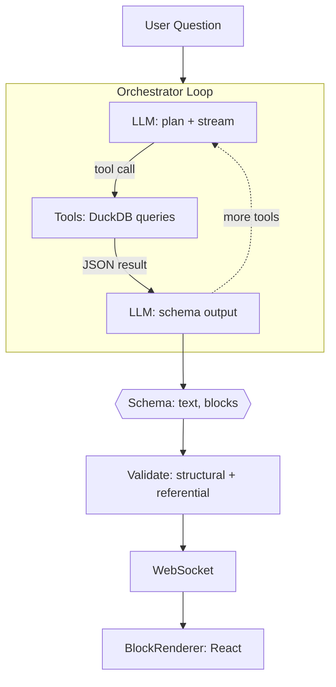
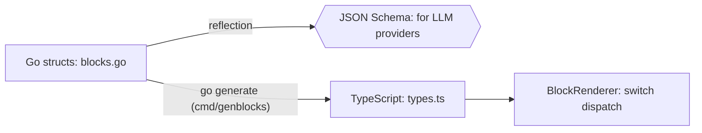
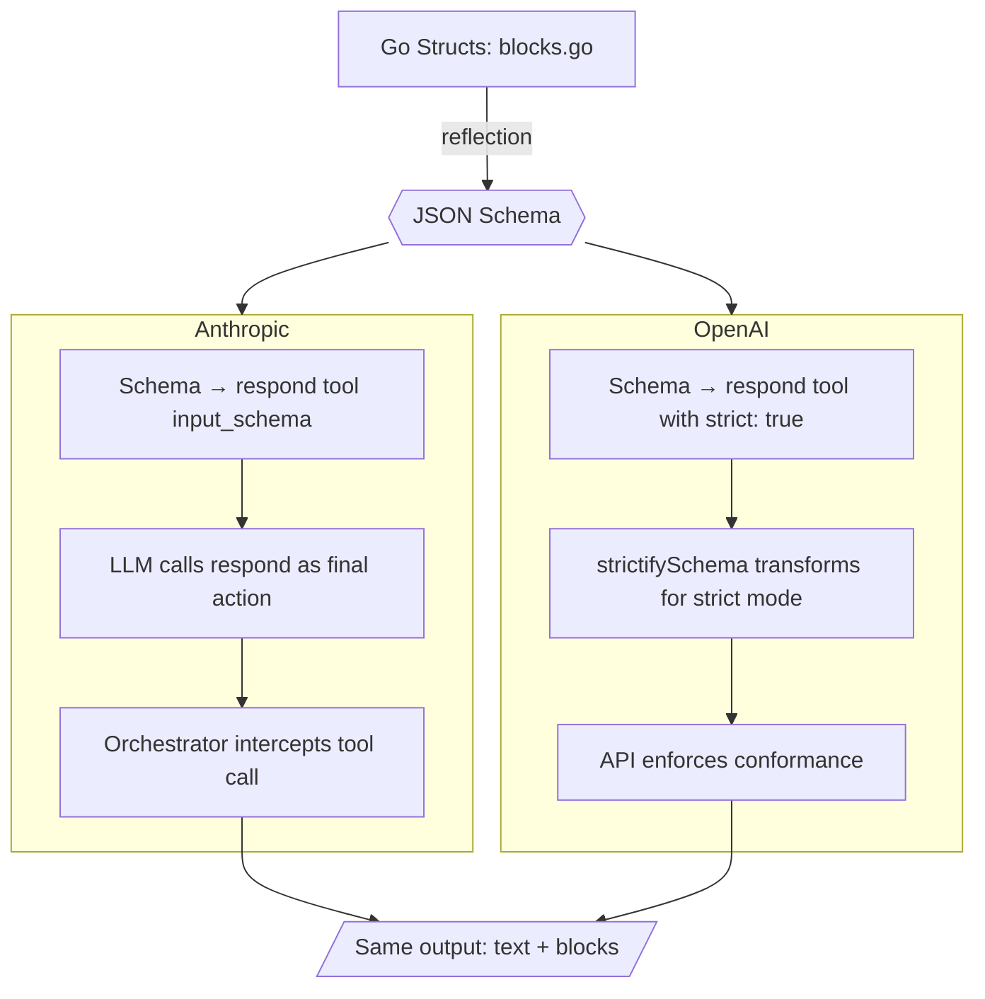

# Architecture: Schema-Driven Block Output

> LLM owns both narrative and visualization. Tools own data. Schema owns correctness.

---

## 1. Design Principle

| Layer | Owns | Does NOT own |
|-------|------|-------------|
| **Tools** | Data retrieval, SQL, aggregation | Presentation, formatting |
| **LLM** | Narrative, visualization selection, data mapping | Query execution, raw data |
| **Schema** | Structural correctness, type safety | Semantic correctness |
| **Client** | Rendering, interaction | Data fetching, business logic |

The LLM is the only component that sees both the user's intent and the tool results. It is the natural place to decide that a bar chart is better than a table for a particular answer.

---

## 2. Pipeline



The orchestrator runs an agentic loop. On each iteration, the LLM can call tools (DuckDB queries) or produce its final response. Iterations 1..N stream text tokens freely — the user sees "Checking system status..." in real time. Only the **final** iteration uses schema-constrained output via the `respond` tool, producing `{ text, blocks[] }`. The user never stares at a blank screen.

After schema enforcement, a validation layer checks semantic invariants (finite numbers, array lengths, internal references). Valid blocks are sent over WebSocket and rendered by the React `BlockRenderer`.

---

## 3. Schema

The LLM's final response is constrained by a JSON schema passed as the `respond` tool's `input_schema`. The schema is generated at runtime via `sync.Once` from Go struct reflection — not from `$ref`/`$defs`.

### Response Shape

The actual schema uses inline `oneOf` with all variant schemas directly embedded:

```json
{
  "type": "object",
  "required": ["text", "blocks"],
  "additionalProperties": false,
  "properties": {
    "text": {
      "type": "string",
      "description": "Markdown text response to the user."
    },
    "blocks": {
      "type": "array",
      "items": {
        "oneOf": [
          {
            "type": "object",
            "required": ["type", "data"],
            "additionalProperties": false,
            "properties": {
              "type": { "type": "string", "const": "metrics" },
              "data": { "type": "object", "properties": { "items": { ... } } }
            }
          },
          {
            "type": "object",
            "required": ["type", "data"],
            "additionalProperties": false,
            "properties": {
              "type": { "type": "string", "const": "timeseries" },
              "data": { "type": "object", "properties": { ... } }
            }
          }
        ]
      }
    }
  }
}
```

Repeats for all 15 types. Generated from Go structs on first use via `sync.Once`.

### Block Type Reference

| Type | Data Shape | Use When |
|------|-----------|----------|
| `text` | `{content}` | Markdown callout mid-response |
| `metrics` | `{items[]}` | 2-6 KPI cards |
| `table` | `{columns[], rows[]}` | Tabular data |
| `timeseries` | `{title, labels[], series[]}` | Trends over time |
| `bar` | `{title, bars[]}` | Ranked comparisons |
| `heatmap` | `{title, buckets[], times[], values[][]}` | Latency distributions |
| `trace_waterfall` | `{spans[]}` | Single distributed trace |
| `topology` | `{nodes[], edges[]}` | Service dependency graph |
| `flame_graph` | `{frames[]}` | Aggregated span breakdown |
| `sankey` | `{nodes[], links[]}` | Request flow |
| `dep_matrix` | `{services[], cells[]}` | NxN health matrix |
| `endpoints` | `{endpoints[]}` | Per-endpoint breakdown |
| `correlation` | `{times[], panels[]}` | Multi-signal correlation |
| `logs` | `{entries[]}` | Log entries |
| `comparison` | `{items[]}` | Side-by-side comparison |

---

## 4. Source of Truth



Go structs in `internal/ai/blocks.go` are the single source of truth. The JSON schema is generated from them at runtime via reflection (`internal/ai/schema_gen.go`). TypeScript types (`client/src/lib/types.ts`) are auto-generated from the same Go structs via `cmd/genblocks` (`go generate ./internal/ai/...`).

---

## 5. Provider Abstraction

Both providers use a synthetic "respond" tool. The schema is embedded in the tool's `InputSchema`, not passed through `StreamParams`. Each provider enforces it using its native mechanism:



**Anthropic:** defines a synthetic "respond" tool whose `input_schema` is the response schema. The LLM is instructed to call it as its final action. The orchestrator intercepts this tool call — it's not executed, it's the structured response.

**OpenAI:** uses the same respond tool but with `strict: true` on the function definition. The `strictifySchema()` function transforms the schema to meet OpenAI's strict mode requirements (`additionalProperties: false`, all properties required, optional fields wrapped in `anyOf` with null).

### Provider Interface

```go
type StreamParams struct {
    System       string
    SystemBlocks []SystemBlock
    Messages     []Message
    Tools        []ToolDef
    MaxTokens    int
}
```

---

## 6. Orchestrator Loop

```go
func (o *Orchestrator) Run(ctx context.Context, conversation []Message, window int, namespace string, send SendFunc) ([]Message, *TailConfig, error) {
    systemBlocks := o.buildSystemBlocks(ctx, window, namespace)

    for i := 0; i < maxIterations; i++ {
        tools := append(o.tools.Defs(), respondToolDef())

        // Stream with callback — tokens are sent to client in real time
        err := o.provider.Stream(ctx, StreamParams{
            SystemBlocks: systemBlocks,
            Messages:     conversation,
            Tools:        tools,
            MaxTokens:    4096,
        }, func(event StreamEvent) error {
            // Forward text tokens and tool call events to WebSocket
        })

        // Check for respond tool call
        if respondCall != nil {
            // Parse structured response from tool input
            var resp struct {
                Text   string  `json:"text"`
                Blocks []Block `json:"blocks"`
            }
            json.Unmarshal([]byte(respondCall.Input), &resp)
            blocks := validateBlocks(resp.Blocks)
            send(ClientEvent{Type: CEDone, Blocks: blocks})
            return conversation, tailCfg, nil
        }

        // Otherwise execute real tool calls and loop
    }
}
```

The `respondToolDef()` function builds the synthetic tool definition with the generated schema as its `InputSchema`. It is NOT in the `ToolRegistry` — it is appended to the tools list and intercepted by the orchestrator when called.

---

## 7. Validation

Schema enforcement guarantees **structural** correctness. The validation layer catches **semantic** issues the schema can't express:

| Check | Applies To | Example |
|-------|-----------|---------|
| Finite numbers | metrics, timeseries, bar, heatmap | No NaN or Infinity |
| Array length match | timeseries, heatmap, correlation | `values[]` length == `labels[]` length |
| Internal references | trace_waterfall, topology, sankey | Parent/edge IDs reference real nodes |
| Non-empty | all | No empty charts |

**Does not check:**
- Value accuracy (142ms vs 145ms is fine — LLM is summarizing, not transcribing)
- Visualization choice quality (bar vs table — that's the LLM's job)

**Failure mode:** invalid blocks are dropped individually. Text and remaining blocks are still delivered.

---

## 8. System Prompt

The system prompt tells the LLM how to use the response schema:

```text
## Response Format

Your final response must include:
- `text`: Markdown analysis. Be direct, cite numbers, explain root causes.
- `blocks`: Visualization blocks. Choose the best type for the data.

## Block Selection Guide

- `metrics`         — 2-6 KPI summary cards
- `table`           — tabular data, top errors, search results
- `timeseries`      — trends over time
- `bar`             — ranked comparisons
- `heatmap`         — latency distributions over time
- `trace_waterfall` — single distributed trace
- `topology`        — service dependency graph
- `flame_graph`     — aggregated span breakdowns
- `sankey`          — request flow between services
- `dep_matrix`      — NxN service health grid
- `endpoints`       — per-endpoint breakdowns
- `correlation`     — multi-signal correlation
- `logs`            — log entries
- `comparison`      — side-by-side comparison

## Rules

- Block data MUST come from tool results. Never invent data points.
- Prefer visualization over text. Don't describe data the user can see.
- 1-3 blocks per response. More is clutter.
- Most specific type wins: `endpoints` > `table` for endpoint data.
```

---

## 9. Schema Generation

The schema is generated from Go structs using reflection, ensuring Go types, TypeScript types, and JSON schema stay in sync:

```go
// internal/ai/schema_gen.go

func generateResponseSchema() json.RawMessage {
    // Built once via sync.Once, cached for all subsequent requests.
    // Iterates BlockTypeRegistry, calling reflectSchema() on each
    // entry's Data struct to produce inline oneOf variants.
}
```

TypeScript types are generated from the same Go structs via `cmd/genblocks`:

```go
//go:generate sh -c "go run ../../cmd/genblocks > ../../client/src/lib/types.ts"
```

Run `just gen` or `go generate ./internal/ai/...` to regenerate TypeScript types.

---

## 10. Client

The React client in `client/` renders block responses:

- **WebSocket** (`client/src/lib/ws.ts`): Connects to `/ws/chat`, handles reconnection with exponential backoff
- **Zustand store** (`client/src/stores/chat.ts`): Manages conversation state, processes `ChatEvent` messages
- **BlockRenderer** (`client/src/components/blocks/BlockRenderer.tsx`): Dispatches to per-type components based on `block.type`
- **Block components**: D3 (topology, flame graph, sankey), Recharts (timeseries, bar, heatmap, correlation), TanStack Table (table), custom (metrics cards, trace waterfall, endpoints)

All 15 block types are rendered via a `switch` on `block.type` in `BlockRenderer`.

---

## 11. Risks

| Risk | Likelihood | Impact | Mitigation |
|------|-----------|--------|------------|
| Wrong viz type | Medium | Low | System prompt guidance, easy to iterate |
| Fabricated data | Low | Medium | Validation + "must come from tool results" |
| Schema output latency | Low | Low | Only final call is constrained |
| Provider unsupported | Low | High | Both Anthropic and OpenAI supported |
| Schema drift Go/TS | Medium | Medium | TS generated from Go structs via go:generate |
| Too many blocks | Low | Low | System prompt caps at 1-3 |
