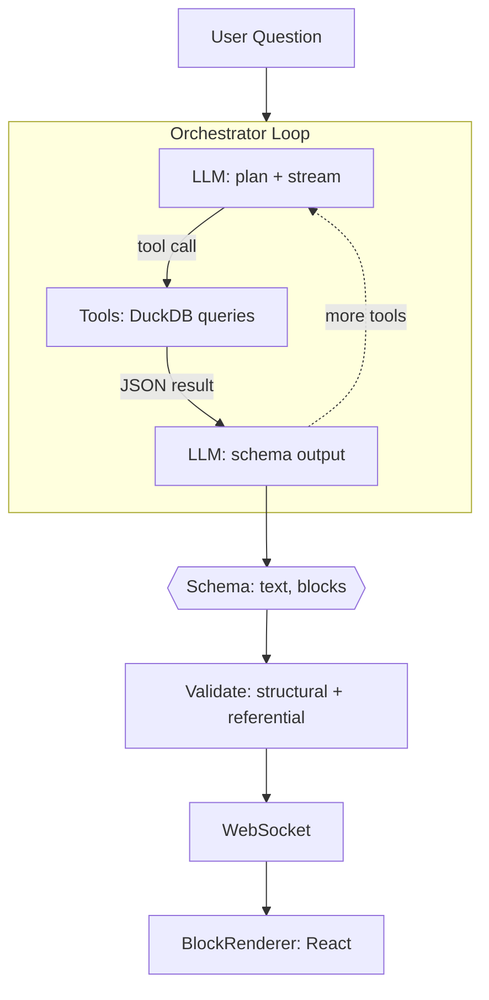
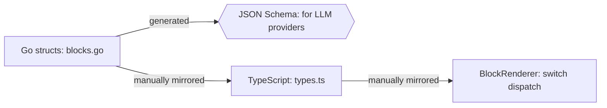
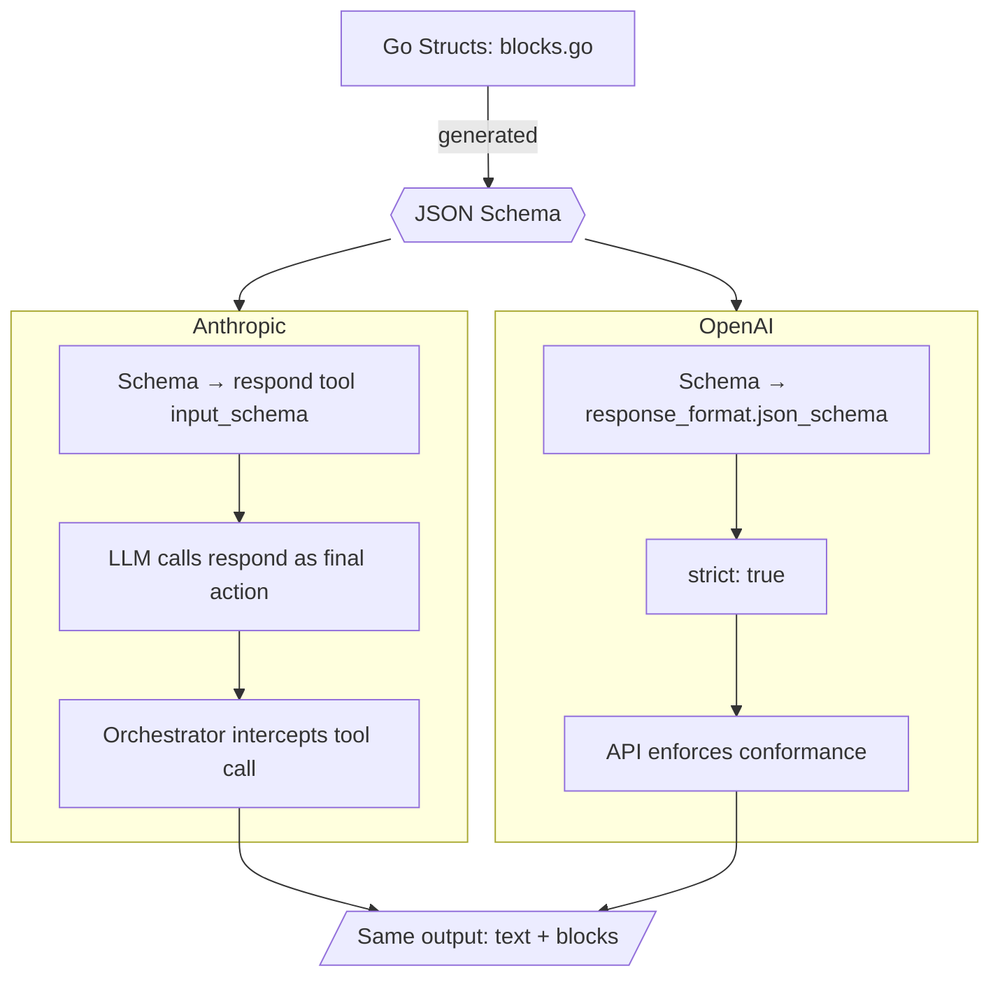
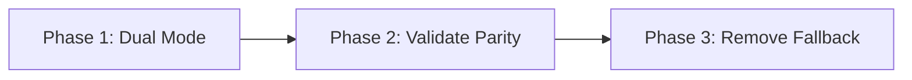

# Architecture: Schema-Driven Block Output

> LLM owns both narrative and visualization. Tools own data. Schema owns correctness.

---

## 1. Design Principle

| Layer | Owns | Does NOT own |
|-------|------|-------------|
| **Tools** | Data retrieval, SQL, aggregation | Presentation, formatting |
| **LLM** | Narrative, visualization selection, data mapping | Query execution, raw data |
| **Schema** | Structural correctness, type safety | Semantic correctness |
| **Client** | Rendering, interaction | Data fetching, business logic |

The LLM is the only component that sees both the user's intent and the tool results. It is the natural place to decide that a bar chart is better than a table for a particular answer.

---

## 2. Pipeline



The orchestrator runs an agentic loop. On each iteration, the LLM can call tools (DuckDB queries) or produce its final response. Iterations 1..N stream text tokens freely — the user sees "Checking system status..." in real time. Only the **final** iteration uses schema-constrained output, producing `{ text, blocks[] }`. The user never stares at a blank screen.

After schema enforcement, a validation layer checks semantic invariants (finite numbers, array lengths, internal references). Valid blocks are sent over WebSocket and rendered by the React `BlockRenderer`.

---

## 3. Schema

The LLM's final response is constrained to a JSON schema enforced by the provider at the API level. The LLM cannot return non-conforming output.

### Response Shape

```json
{
  "type": "object",
  "required": ["text", "blocks"],
  "additionalProperties": false,
  "properties": {
    "text": {
      "type": "string",
      "description": "Markdown narrative."
    },
    "blocks": {
      "type": "array",
      "items": { "$ref": "#/$defs/Block" }
    }
  }
}
```

### Block Discriminated Union

Each block is a tagged union on `type`. The `data` shape varies per type:

```json
{
  "$defs": {
    "Block": {
      "oneOf": [
        {
          "properties": {
            "type": { "const": "metrics" },
            "data": { "$ref": "#/$defs/MetricsBlockData" }
          }
        },
        {
          "properties": {
            "type": { "const": "timeseries" },
            "data": { "$ref": "#/$defs/TimeseriesBlockData" }
          }
        }
      ]
    }
  }
}
```

Repeats for all 14 types. Generated from Go structs at build time.

### Block Type Reference

| Type | Data Shape | Use When |
|------|-----------|----------|
| `text` | `{content}` | Markdown callout mid-response |
| `metrics` | `{items[]}` | 2-6 KPI cards |
| `table` | `{columns[], rows[]}` | Tabular data |
| `timeseries` | `{title, labels[], series[]}` | Trends over time |
| `bar` | `{title, bars[]}` | Ranked comparisons |
| `heatmap` | `{title, buckets[], times[], values[][]}` | Latency distributions |
| `trace_waterfall` | `{spans[]}` | Single distributed trace |
| `topology` | `{nodes[], edges[]}` | Service dependency graph |
| `flame_graph` | `{frames[]}` | Aggregated span breakdown |
| `sankey` | `{nodes[], links[]}` | Request flow |
| `dep_matrix` | `{services[], cells[]}` | NxN health matrix |
| `endpoints` | `{endpoints[]}` | Per-endpoint breakdown |
| `correlation` | `{times[], panels[]}` | Multi-signal correlation |
| `tail` | `{entries[]}` | Log entries |

---

## 4. Source of Truth



Go structs in `internal/ai/blocks.go` are the single source. The JSON Schema is generated from them at build time via reflection. TypeScript types (`client/src/lib/types.ts`) and `BlockRenderer` are manually mirrored today — future improvement: generate TS from Go too.

---

## 5. Provider Abstraction

The orchestrator passes a JSON schema. Each provider enforces it using its native mechanism. The orchestrator doesn't care which:



**Anthropic:** defines a synthetic "respond" tool whose `input_schema` is the response schema. The LLM is instructed to call it as its final action. The orchestrator intercepts this tool call — it's not executed, it's the structured response.

**OpenAI:** uses the native `response_format.json_schema` with `strict: true`. The API enforces conformance directly.

### Provider Interface

```go
type StreamParams struct {
    SystemBlocks   []SystemBlock
    Messages       []Message
    Tools          []ToolDef
    MaxTokens      int
    ResponseSchema json.RawMessage  // the Block[] schema
}
```

---

## 6. Orchestrator Loop

```go
func (o *Orchestrator) Run(ctx context.Context, conv []Message, send SendFunc) ([]Message, error) {
    for i := 0; i < maxIterations; i++ {
        resp, err := o.provider.Stream(ctx, StreamParams{
            SystemBlocks:   o.systemBlocks(ctx),
            Messages:       conv,
            Tools:          o.tools.Defs(),
            ResponseSchema: o.responseSchema,
            MaxTokens:      4096,
        })

        // Tool calls: execute and loop
        if resp.StopReason == "tool_use" && !resp.IsRespondTool() {
            continue
        }

        // Final response: parse schema-enforced output
        var result struct {
            Text   string  `json:"text"`
            Blocks []Block `json:"blocks"`
        }
        json.Unmarshal(resp.StructuredOutput, &result)

        blocks := o.validate(result.Blocks, toolResults)
        if result.Text != "" {
            blocks = append([]Block{MakeTextBlock(result.Text)}, blocks...)
        }

        send(ClientEvent{Type: CEDone, Blocks: blocks})
        return conv, nil
    }
}
```

The loop is the same agentic loop used today. The only change: the final LLM call uses schema-constrained output instead of free text, and there are no per-tool `*ToBlocks()` mapping functions.

---

## 7. Validation

Schema enforcement guarantees **structural** correctness. The validation layer catches **semantic** issues the schema can't express:

| Check | Applies To | Example |
|-------|-----------|---------|
| Finite numbers | metrics, timeseries, bar, heatmap | No NaN or Infinity |
| Array length match | timeseries, heatmap, correlation | `values[]` length == `labels[]` length |
| Internal references | trace_waterfall, topology, sankey | Parent/edge IDs reference real nodes |
| Non-empty | all | No empty charts |

**Does not check:**
- Value accuracy (142ms vs 145ms is fine — LLM is summarizing, not transcribing)
- Visualization choice quality (bar vs table — that's the LLM's job)

**Failure mode:** invalid blocks are dropped individually. Text and remaining blocks are still delivered.

---

## 8. System Prompt

The system prompt tells the LLM how to use the response schema:

```text
## Response Format

Your final response must include:
- `text`: Markdown analysis. Be direct, cite numbers, explain root causes.
- `blocks`: Visualization blocks. Choose the best type for the data.

## Block Selection Guide

- `metrics`         — 2-6 KPI summary cards
- `table`           — tabular data, top errors, search results
- `timeseries`      — trends over time
- `bar`             — ranked comparisons
- `heatmap`         — latency distributions over time
- `trace_waterfall` — single distributed trace
- `topology`        — service dependency graph
- `flame_graph`     — aggregated span breakdowns
- `sankey`          — request flow between services
- `dep_matrix`      — NxN service health grid
- `endpoints`       — per-endpoint breakdowns
- `correlation`     — multi-signal correlation
- `tail`            — log entries

## Rules

- Block data MUST come from tool results. Never invent data points.
- Prefer visualization over text. Don't describe data the user can see.
- 1-3 blocks per response. More is clutter.
- Most specific type wins: `endpoints` > `table` for endpoint data.
```

---

## 9. Schema Generation

The schema is generated from Go structs, ensuring Go types, TypeScript types, and JSON schema stay in sync:

```go
// internal/ai/schema_gen.go

func GenerateResponseSchema() json.RawMessage {
    schema := jsonschema.Reflect(&ResponseShape{})
    b, _ := json.Marshal(schema)
    return b
}

type ResponseShape struct {
    Text   string  `json:"text" jsonschema:"description=Markdown narrative"`
    Blocks []Block `json:"blocks" jsonschema:"description=Visualization blocks"`
}
```

The schema is compiled once at startup and reused for every request.

---

## 10. Client

No client changes. The client already handles all 14 block types via `BlockRenderer`. The `Block` interface and rendering pipeline are unchanged. Blocks arrive over the same WebSocket `CEDone` event in the same shape — the only difference is that all 14 types are now reachable.

---

## 11. Migration



**Phase 1 — Dual mode:** schema-driven blocks preferred, existing `toolResultToBlocks()` as fallback for schema failures or unsupported providers.

```go
if len(result.Blocks) > 0 {
    blocks = o.validate(result.Blocks, toolResults)
} else {
    blocks = toolResultToBlocks(toolName, toolResult)
}
```

**Phase 2 — Validate parity:** run both paths in parallel, log discrepancies. Verify the LLM consistently picks appropriate visualizations.

**Phase 3 — Remove fallback:** delete `tool_blocks.go` (~550 lines). The LLM is the sole block source.

---

## 12. Risks

| Risk | Likelihood | Impact | Mitigation |
|------|-----------|--------|------------|
| Wrong viz type | Medium | Low | System prompt guidance, easy to iterate |
| Fabricated data | Low | Medium | Validation + "must come from tool results" |
| Schema output latency | Low | Low | Only final call is constrained |
| Provider unsupported | Low | High | Dual mode fallback (Phase 1) |
| Schema drift Go/TS | Medium | Medium | Generate schema from Go structs |
| Too many blocks | Low | Low | System prompt caps at 1-3 |
