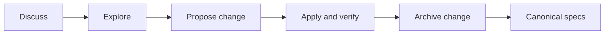

# Fanout documentation

Fanout uses [OpenSpec](https://github.com/Fission-AI/OpenSpec) to keep current
behavior, proposed work, historical decisions, and operator procedure separate.

| Need | Source |
|---|---|
| What Fanout does now | [`openspec/specs/`](../openspec/specs/) |
| What may change next | [`openspec/changes/`](../openspec/changes/) |
| Why an approved OpenSpec change was made | [`openspec/changes/archive/`](../openspec/changes/archive/) |
| How to install and operate Fanout | [`site/src/pages/docs/index.mdx`](../site/src/pages/docs/index.mdx) |
| Fast project setup | [`README.md`](../README.md) |

## Capability map

| Area | Canonical capability |
|---|---|
| Promise, scope, runtime boundaries | `product-foundation` |
| OTLP/gRPC intake and ingest credentials | `telemetry-ingestion` |
| DuckLake/Parquet persistence and DuckDB queries | `telemetry-storage-query` |
| Overview, topology, performance, traces, logs | `investigation-experience` |
| Named owner-scoped canvases | `dashboards` |
| Rules, state, webhooks, history | `alerting` |
| AG-UI runtime, tools, remote MCP, MCP Apps | `agent-and-mcp` |
| Setup, login, roles, sessions, OAuth, auditing | `identity-and-access` |
| Packaging, configuration, health, metrics, lifecycle | `operations` |

## Lifecycle

1. Explore the problem without changing the current contract.
2. Propose an OpenSpec change with requirement deltas before material behavior
   changes.
3. Apply its tasks while keeping code, tests, public docs, and deltas aligned.
4. Run `just docs-check` and the relevant code/UI checks.
5. Archive only after behavior is implemented and verified. Archiving merges the
   deltas into canonical specs and preserves the decision record.

Codex exposes `$openspec-explore`, `$openspec-propose`,
`$openspec-apply-change`, and `$openspec-archive-change`. Claude Code exposes
the corresponding `/opsx:*` commands. GitHub Copilot prompt files live in
`.github/prompts/`.

## Rules

- `openspec/specs/` describes shipped, verified behavior only.
- Future behavior belongs in a named directory under `openspec/changes/`.
- Requirements use observable scenarios; implementation details belong in a
  change design unless they are compatibility, security, persistence, or
  operational contracts.
- Runbooks remain in `docs/` or `site/`, link to the behavioral specs, and do
  not redefine them.
- Archive only OpenSpec change artifacts. Superseded standalone plans, visions,
  requirements, references, and prototypes are deleted after consolidation.
- Mermaid source lives with its owning requirement or design. Rendered diagrams
  and prototypes are not a second source of truth.
