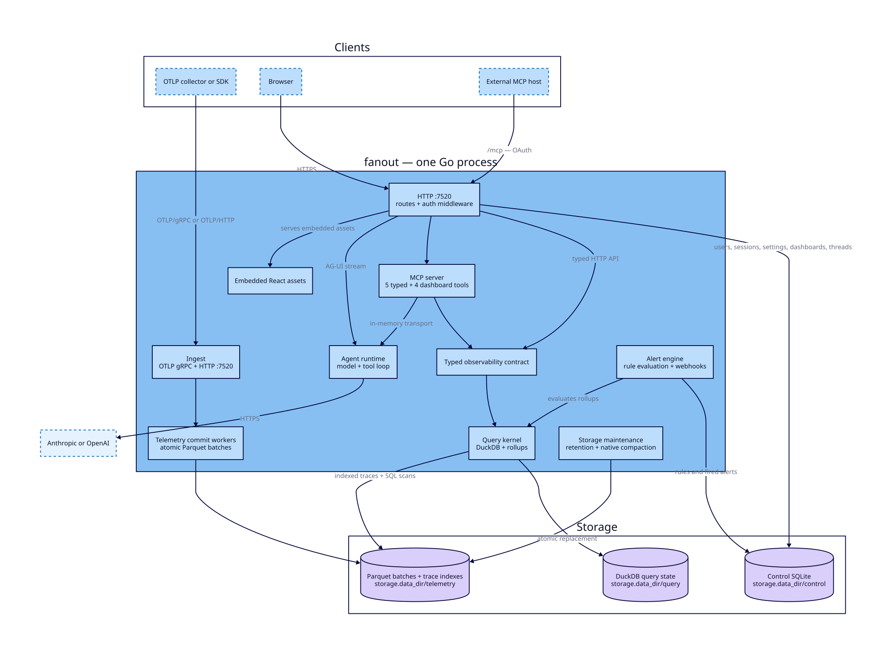
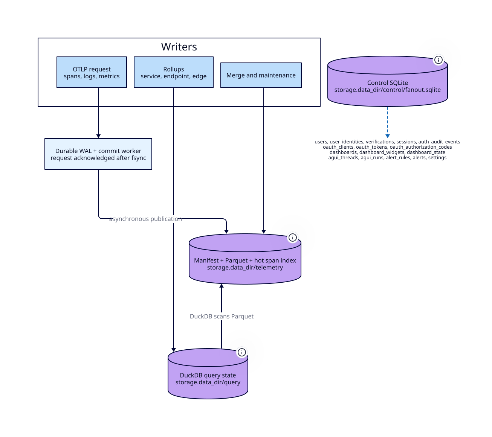

# Fanout architecture

How Fanout is put together. This describes *structure* — which component owns
what, and how a request reaches storage.

For what Fanout is contractually required to **do**, read
[`openspec/specs/`](../openspec/specs/). This document links to those
capabilities rather than restating them; where the two disagree, the specs win.

## The shape of it

Fanout is one Go executable. A single process accepts OTLP over gRPC, stores
telemetry as Parquet under a DuckLake catalog, answers queries through an
embedded DuckDB, serves a typed HTTP API, hosts an MCP server, runs the
model/tool loop behind an AG-UI event stream, and serves the compiled React
client from its own binary.

There is no sidecar, no second service, no separate database process, and no
Node or Bun at runtime. Bun is a build-time dependency only, for compiling
browser assets that are then embedded into the binary.



The constraint that shapes almost everything else: **the internal agent is not a
privileged path.** It reaches the same MCP tools an external client uses, over
an in-memory transport (`internal/agent/tools.go`). There is no HTTP self-call,
no loopback bearer token, and no second tool registry to keep in sync. A tool
added for external MCP hosts is immediately available to the built-in agent, and
vice versa.

Normative version: [`product-foundation`](../openspec/specs/product-foundation/spec.md).

## How a request travels

**Telemetry in.** A collector or SDK sends OTLP to `:4317`. The ingest server
normalizes it and hands it to the lake writer, which buffers and flushes in
batches (`FLUSH_BATCH_SIZE`, 50,000 rows by default). Flushes append Parquet and
commit through the write gate. See
[`telemetry-ingestion`](../openspec/specs/telemetry-ingestion/spec.md).

**Questions out.** Browser navigation, dashboards, MCP tools, and the agent all
resolve through one typed observability contract, so the same question returns
the same schema regardless of which surface asked. The query kernel serves it
from DuckDB, preferring rollups and falling back to raw scans. See
[`telemetry-storage-query`](../openspec/specs/telemetry-storage-query/spec.md)
and [`investigation-experience`](../openspec/specs/investigation-experience/spec.md).

**Conversation.** `POST /api/agent` streams standard AG-UI run, text-message,
tool-call, tool-result, and activity events. MCP App results ride as
`ACTIVITY_SNAPSHOT` events carrying the resource URI plus tool input and result;
the browser renders them with the official `AppBridge` and
`PostMessageTransport`. There is no Fanout-specific UI-block protocol. See
[`agent-and-mcp`](../openspec/specs/agent-and-mcp/spec.md).

## Storage, and the one lock that matters

Three stores, with different jobs:



`DATA_DIR/telemetry` holds the DuckLake catalog and partitioned Parquet — the
telemetry itself. `DATA_DIR/query` holds DuckDB's catalog attachment and temp
spill. `DATA_DIR/control/fanout.sqlite` holds everything that is *not*
telemetry: users, identities, sessions, audit events, MCP OAuth clients and
tokens, dashboards and widgets, AG-UI threads and runs, and alert rules.

Every catalog write — ingest flushes, all three rollups, adjacent-file merge,
and maintenance — passes through one process-wide gate
(`internal/lake/writegate`). Exactly one catalog write is in flight at a time,
and the gate is always acquired *before* a database connection or transaction.

This is the system's main contention point, and it is instrumented: the gate
records wait and hold time per operation, so
`fanout_write_gate_wait_seconds{operation="ingest_*"}` against
`fanout_write_gate_hold_seconds{operation="rollup_*"}` shows directly how much
ingest is stalling behind background work.

## Repository layout

```text
cmd/fanout/                 process composition and the single entry point
cmd/bench/                  load generator and benchmark reporter
internal/agent/             providers, AG-UI runtime, MCP tool adapter, history
internal/alert/             expr-lang alert engine, rule store, webhook delivery
internal/api/               HTTP routes, auth middleware, settings, alerts, health
internal/auth/              email/OIDC login, browser sessions, MCP OAuth store
internal/brand/             shared brand assets
internal/dashboard/         dashboard domain service, validation, and identity
internal/db/                control SQLite schema, migrations, and sqlc queries
internal/env/               environment config loading and validation
internal/id/                UUIDv7 identifier generation
internal/ingest/            OTLP gRPC receiver
internal/intelligence/      anomaly detection
internal/lake/              DuckLake/Parquet writer and maintenance
internal/lake/writegate/    the shared catalog write gate and its metrics
internal/mcp/               MCP tools, server, and embedded MCP App HTML
internal/metrics/           Prometheus metrics
internal/observability/     typed query/result domain types
internal/query/             DuckDB catalog, queries, and rollups
internal/settings/          ingest-token and application settings store
internal/store/             control SQLite bootstrap
internal/ui/                embedded compiled browser assets only
ui/host/                    React AG-UI browser host (build-time)
ui/apps/                    portable React MCP Apps (build-time)
site/                       public site and documentation
```

`internal/ui` is deliberately small — it embeds and serves the compiled shell
and is not a renderer registry. React source lives in `ui/host`; portable
tool-result apps live in `ui/apps`.

## Interfaces

Nine MCP tools, registered in `internal/mcp/`. Five return typed observability
results paired with an MCP App resource: `observability_overview`,
`service_topology`, `service_performance`, `trace_detail`, `search_logs`. Four
manage owner-scoped dashboards: `dashboard_list`, `dashboard_get`,
`dashboard_create`, `dashboard_update`. Dashboard tools additionally require the
`fanout:dashboard` scope, and the owner always comes from the verified token or
the internal agent's request meta — never from tool input.

Hosts without MCP Apps still receive useful structured and text results.

Auth middleware is global, and browser sessions are opaque server-side records
in an HttpOnly cookie. Thread IDs are not an authorization boundary: the store
scopes them to the authenticated owner. See
[`identity-and-access`](../openspec/specs/identity-and-access/spec.md).

Operational surfaces — configuration, health, `/-/metrics`, lifecycle — are
specified in [`operations`](../openspec/specs/operations/spec.md). Alerting is in
[`alerting`](../openspec/specs/alerting/spec.md); dashboards in
[`dashboards`](../openspec/specs/dashboards/spec.md).

## Diagrams

Sources are d2 in `docs/diagrams/`, rendered to SVG committed beside them:

```sh
just diagrams    # requires d2 (brew install d2)
```

Editing a diagram means editing the `.d2` and re-running that command, so the
rendered output is reproducible rather than hand-made. Reading the diagrams
requires nothing installed.

## Checking this document

Structure drifts. These claims are mechanically checkable — the layout above was
already wrong in `CLAUDE.md` before this document existed:

```sh
ls internal/ cmd/                                     # layout table
grep -rn 'NewInMemoryTransports' internal/agent/      # no HTTP self-call
grep -rn 'AddTool' internal/mcp/ | wc -l              # tool count
grep -rn 'writegate' internal/query/ internal/lake/   # every gated write path
grep -n 'DATA_DIR\|HTTP_ADDR\|OTLP_GRPC_ADDR' internal/env/config.go
```

Behavioral claims are not checked here on purpose — they belong to
`openspec/specs/`, validated by `just docs-check`.
