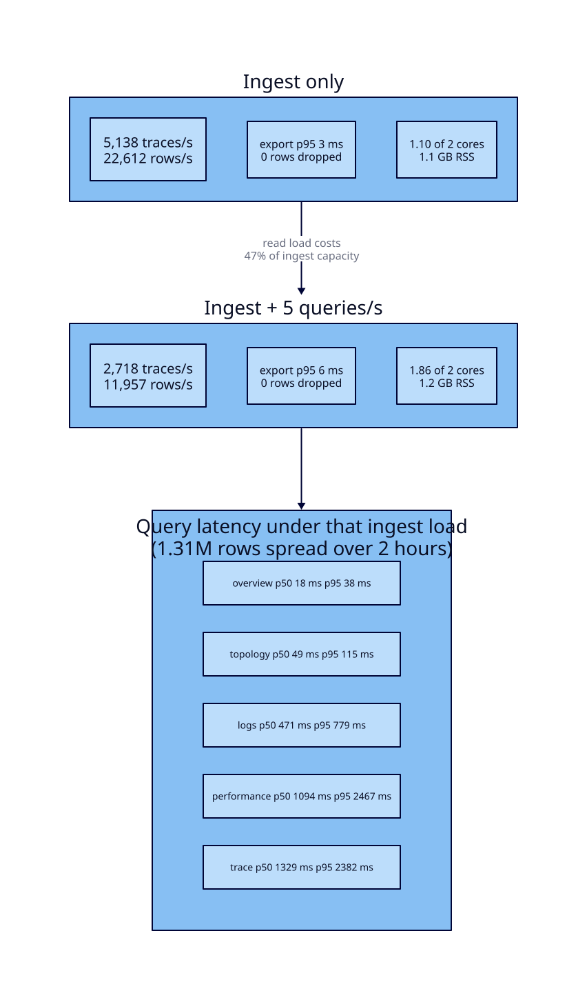

# Fanout on two dedicated vCPUs

**2026-08-04** · image `ghcr.io/labstack/fanout@sha256:feebc9cfc09b1aea4c6165f6d700b976489de237a2fd17c37581b2fea8b3864e` · Hetzner `ccx13`

Two dedicated cores and 8 GB of RAM, rented for about €0.07 an hour, sustained
**5,138 traces/s — 22,612 rows/s** with zero rows dropped and an export p95 of
3 ms. Adding a realistic dashboard read load of 5 queries/s cost roughly half
that ingest capacity and left interactive queries under 120 ms.

Every number here came from a run whose method is recorded below, and nothing
was extrapolated. The historical run omitted ingest authentication; the current
reproduction commands deliberately use normal credentials, so they exercise a
slightly stricter path than the published measurement.

## Setup



The load generator ran on a second machine in the same datacenter, connected
over a Hetzner private network. This matters: generating load on the box under
test spends part of the two cores producing the work being measured. Earlier
attempts that co-located the driver understated throughput.

| | System under test | Load driver |
| --- | --- | --- |
| Type | `ccx13` | `cpx22` |
| vCPU | 2 **dedicated** | 2 shared |
| RAM | 8 GB | 4 GB |
| Role | Fanout | `cmd/bench` |

Dedicated cores were chosen deliberately. Hetzner's shared-core instances are
cheaper, but a shared core makes run-to-run variance a property of the
neighbours rather than of Fanout, and a benchmark nobody can reproduce is not
worth publishing.

The historical Fanout instance used a tokenless ingest mode, so the headline
number does not include credential verification. That mode has since been
removed: demos and benchmarks now use the same ingest token as production.
`DUCKDB_MEMORY=3GB` was set for reasons explained under
[Memory](#memory-needs-headroom).

## Results



### Ingest

| Measure | Value |
| --- | --- |
| Sustained | **5,138 traces/s** (22,612 rows/s) |
| Peak observed | 7,413 traces/s |
| Export latency | p50 1 ms · p95 3 ms · p99 4 ms |
| Rows dropped | **0** |
| CPU | 1.10 of 2 cores |
| Memory | 1.1 GB RSS |
| On disk | ~99 bytes per row after Parquet compression |

A trace here is not one row. The workload emits spans, logs, and metrics
together, so 5,138 traces/s is 22,612 rows/s of actual stored telemetry.

Ingest did not saturate the machine. At the sustained rate Fanout used 1.10 of
2 cores; the ceiling came from the ingest path rather than from running out of
CPU.

### Query

Measured against 1.31 M rows spread across 2 hours, with ingest running
concurrently at the sustained rate.

| Operation | p50 | p95 | p99 |
| --- | --- | --- | --- |
| `overview` | 18 ms | 38 ms | 158 ms |
| `topology` | 49 ms | 115 ms | 392 ms |
| `logs` | 471 ms | 779 ms | 896 ms |
| `performance` | 1094 ms | 2467 ms | 2685 ms |
| `trace` | 1329 ms | 2382 ms | 2981 ms |

The split is the interesting part. `overview` and `topology` read
pre-aggregated rollups and stay interactive. `performance` and `trace` scan
raw spans and take seconds on two cores. No queries errored.

### What read load costs

| | Ingest only | Ingest + 5 q/s |
| --- | --- | --- |
| Sustained ingest | 5,138 traces/s | 2,718 traces/s |
| Export p95 | 3 ms | 6 ms |
| CPU | 1.10 cores | 1.86 cores |

Five queries per second — a couple of people watching dashboards — cost **47%
of ingest capacity**. On two cores, reads and writes contend directly. Size for
the mixed number, not the ingest-only one.

## What this does not tell you

- **One run each.** These are single measurements, not distributions. Repeating
  them would quantify variance; that was not done.
- **The agent and MCP paths are unmeasured.** They are dominated by model
  latency and would say more about the provider than about Fanout.
- **The historical ingest run omitted authentication.** Current Fanout releases
  require a token on every OTLP request, including demos and benchmarks.
- **One vendor, one shape.** These numbers describe this hardware. They are not
  a claim about equivalent core counts elsewhere.
- **A synthetic workload.** 20 services, 100-value attribute cardinality, 5%
  error rate, 20% of traces emitting a messaging pair. Real telemetry differs.

## Three things worth knowing before you deploy

### Memory needs headroom

An earlier run was **OOM-killed by the kernel** at 7.5 GB RSS on the 7.7 GB
machine. With `DUCKDB_MEMORY` unset, DuckDB sizes itself to 80% of detected RAM
— about 6.2 GB here — and the Go runtime's own footprint on top of that exceeds
the machine. The container had no memory limit, so DuckDB saw the whole host.

This run used `DUCKDB_MEMORY=3GB` with a 6 GB container limit and peaked at
1.2 GB RSS. That explicit value records the historical benchmark configuration;
it is not required for a normal current deployment.

**Since these runs, Fanout resolves this itself.** With
`storage.duckdb.memory` / `FANOUT_DUCKDB_MEMORY` unset it now detects the
container or host limit, reserves headroom for the Go runtime, and logs what it
chose at startup. On the 6 GB container used here it resolves to 3686 MB — close
to the 3 GB pinned by hand above, which is why the numbers still stand.
Operators normally set the container memory limit and let Fanout handle DuckDB;
setting the value explicitly remains an advanced override.

### Capacity falls as the dataset grows

Rollup and merge cost grows with what is stored. In one session the harness
measured 5,810 traces/s during its ramp and then held only 4,372 traces/s
minutes later, with average rollup time climbing to 17.8 s as the lake reached
450 MB. Capacity on a small machine is not a constant.

This is why `cmd/bench` confirms its answer: it ramps to find a rate, then runs
a full pass at that rate and reports whichever is lower.

### Backfill writes are far more expensive than live writes

Seeding with `-backfill-hours 24` sustained only **832 traces/s** against
5,138 traces/s for same-hour writes, and produced 9.37 GB on disk for ~660 k
rows — versus 129 MB for 1.31 M rows spread over 2 hours. Spreading writes
across many hour partitions creates small Parquet files faster than merge
compacts them. Backfilling a long history is not the same workload as ingesting
live telemetry, and should not be sized as if it were.

## Reproducing this

```sh
# On the machine under test
docker run -d --name fanout --memory 6g -p 4317:4317 -p 7520:7520 \
  -e FANOUT_OTLP_GRPC_ADDR=:4317 -e FANOUT_METRICS_TOKEN=... \
  -e FANOUT_DUCKDB_MEMORY=3GB -e FANOUT_DUCKDB_MAX_CONNECTIONS=4 \
  -e FANOUT_AUTH_CODE_SECRET=... -e FANOUT_AI_API_KEY=... \
  -e FANOUT_SMTP_HOST=... -e FANOUT_SMTP_USERNAME=... \
  -e FANOUT_SMTP_PASSWORD=... -e FANOUT_SMTP_FROM=... \
  -v fanout-data:/var/lib/fanout/data \
  ghcr.io/labstack/fanout:latest

# Complete first-admin setup in the browser using the token printed by
# `docker logs fanout`, and save the one-time ingest token as INGEST_TOKEN.
# For mixed read load, create/sign in as a viewer and copy that browser's
# Cookie header as QUERY_SESSION_COOKIE (for example fanout_session=...).

# On a separate driver machine
bench -endpoint <sut>:4317 \
  -token "$INGEST_TOKEN" \
  -metrics-url http://<sut>:7520/-/metrics -metrics-token ... \
  -report ingest.json

# Add read load
bench -endpoint <sut>:4317 -query-url http://<sut>:7520 \
  -token "$INGEST_TOKEN" -query-session-cookie "$QUERY_SESSION_COOKIE" \
  -query-workers 4 -query-rate 5 \
  -metrics-url http://<sut>:7520/-/metrics -metrics-token ... \
  -report mixed.json
```

`cmd/bench` takes no rate. It sizes senders from the driver's cores, ramps until
the server stops keeping up, bisects to find the boundary, then confirms at that
rate. Pass `-rate` explicitly to pin it to a fixed-rate run instead.

There is deliberately no pass/fail latency threshold. A fixed millisecond SLO
encodes the machine it was calibrated on: the same binary clears it on four
cores and fails it on two, reporting a defect where there is only a smaller
computer. Runs still fail hard on dropped rows, a mid-run restart, a lost
metrics baseline, or a send-error rate above 0.1% — conditions that make the
numbers untrustworthy rather than merely unflattering.
